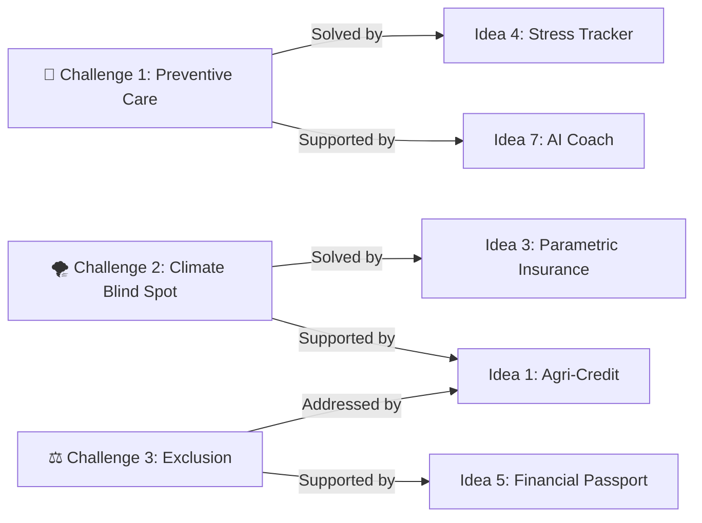

# 👥 Sir Nickler Ideas — Challenges Index

Back to Challenges: [[Finverse Data Access|Finverse Challenges]] | Back to MOC: [[Hackathon MOC]]

This index maps the **three core challenges** surfaced by our teammate (Sir Nickler) in his `Ideas.pdf`. Each challenge has been expanded into a full problem breakdown with Finverse category mappings, root cause analysis, and connections to our own ideas.

---

## 📋 Quick Reference

| # | Challenge Name | Teammate Direction | Key Finverse Categories | Most Connected Idea |
| :--- | :--- | :--- | :--- | :--- |
| 1 | [[Challenge 1 - Preventive Care Gap\|🏥 Preventive Care Gap]] | Direction 1: Financial Health Check-Up Model | Subjective Data, Measuring Financial Health, Applying Insights | [[Idea 4 - Subjective Well-being Tracker\|Idea 4: Stress Tracker]] |
| 2 | [[Challenge 2 - Climate Finance Blind Spot\|🌪️ Climate-Finance Blind Spot]] | Direction 2: Shock Absorption for Climate-Vulnerable Members | Data Availability, Timely Data, Disconnected Systems | [[Idea 3 - Parametric Micro-Insurance Registry\|Idea 3: Parametric Insurance]] |
| 3 | [[Challenge 3 - Invisible Exclusion Problem\|⚖️ Invisible Exclusion Problem]] | Direction 3: Bias & Exclusion Audit for FSPs | Disconnected Systems, Identifying Patterns, Applying Insights | [[Idea 1 - Alt-Data Credit Scoring for Farmers\|Idea 1: Agri-Credit Scoring]] |

---

## 🔍 Challenge Summaries

### 🏥 [[Challenge 1 - Preventive Care Gap|Challenge 1: The Preventive Care Gap]]
FSPs only engage when something goes wrong. There is no systematic mechanism for proactively checking in on a member's financial health across all four UN pillars before a crisis emerges. Like healthcare without annual check-ups.

**Root cause**: No shared standard for measuring financial health holistically, and field officers have no tooling or bandwidth for proactive assessments.

---

### 🌪️ [[Challenge 2 - Climate Finance Blind Spot|Challenge 2: The Climate-Finance Blind Spot]]
Cooperative banks in Mindanao have no system connecting PAGASA weather data to their member loan portfolios. They cannot identify which members are in climate-vulnerable livelihoods, pre-position emergency products before typhoons, or disburse fast relief after disasters.

**Root cause**: Climate data and financial data are siloed across completely different systems with no integration pipeline.

---

### ⚖️ [[Challenge 3 - Invisible Exclusion Problem|Challenge 3: The Invisible Exclusion Problem]]
FSPs unknowingly produce inequitable outcomes — smaller loans for women with equivalent profiles, fewer approvals in certain barangays — but have no governance tool to detect these patterns. The exclusion is invisible because data is never disaggregated by gender, geography, or livelihood type.

**Root cause**: Reporting tools show only aggregate numbers. No one is slicing data intersectionally or holding institution practices accountable to equity metrics.

---

## 🔗 Cross-Team Connection Map

Our ideas and our teammate's challenges are **highly complementary**. Here's how they interact:

