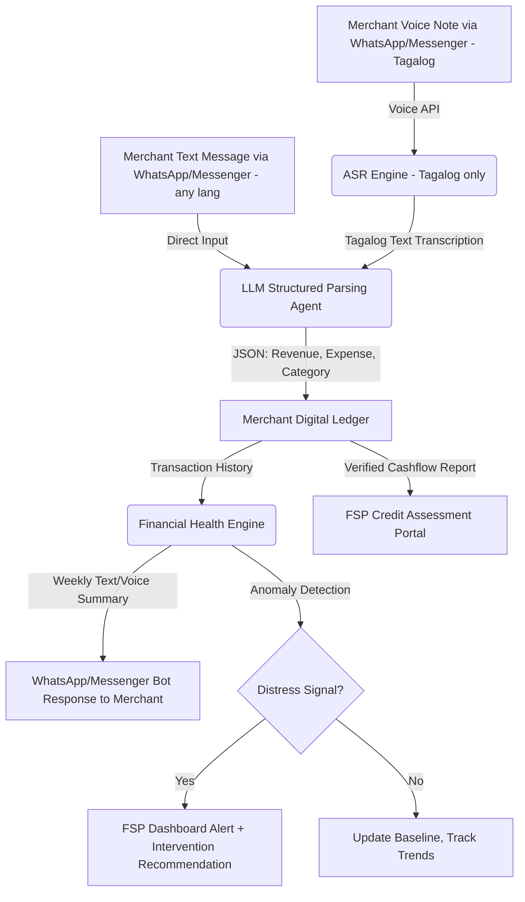

## POLISHED SOLUTION: "Boses" — Voice & Text Ledger for Micro-Merchants

*(Boses = "voice" in Tagalog — frames the tool as a merchant's speaking companion, not another complex app)*

### The Core Problem
Sari-sari store owners — the backbone of Philippine micro-retail — operate on razor-thin margins but have no systematic way to track cashflow. **77.78% lack any formal record-keeping system**, relying instead on personal memory and verbal recall (Malinao, 2026). This financial invisibility locks them out of formal credit: FSPs cannot assess creditworthiness without data, so merchants default to "5-6" informal lenders at 20% interest per month (Tutica, 2023). The gap is not willingness — it's **the absence of a zero-friction tool** that fits into a 14-hour workday.

### The Solution
A **WhatsApp/Messenger/Viber-based assistant** that lets sari-sari store owners do bookkeeping by either **sending a voice note** (Tagalog) or **typing a short message**. The backend structures transactions automatically and surfaces cashflow insights — for both the merchant and the FSP.

> **Design Note — Tagalog-First ASR**: Voice recognition is scoped to **Tagalog only** (Filipino national language). This is a deliberate narrowing: Tagalog ASR has proven <5% Word Error Rate (Pascual et al., 2023), while other PH dialects lack production-ready acoustic models. The text input option covers merchants who speak other dialects or prefer typing. Voice support can expand to Cebuano, Ilocano, etc. in future iterations as ASR models mature.

**How it works:**

```
Merchant chooses their input method:

Option A — Voice Note (Tagalog):
"Bumili ako ng tatlong case ng softdrinks, 900 piso lahat. Benta kahapon, 1,200."

Option B — Text Message (any language):
"bought 3 case softdrinks 900 / benta kahapon 1200"

Boses Bot → Response (same for both):
"Got it! Expense: ₱900 (inventory). Revenue: ₱1,200. 
 Net today: ₱300. Weekly net: +12% vs last week. 👍"
```

**The pipeline:**
1. Merchant sends **either** a voice note **or** a text message via WhatsApp/Messenger/Viber
2. If voice: ASR engine transcribes Tagalog speech to text (~4-7% WER, Pascual et al., 2023)
3. If text: LLM processes the raw message directly (bypasses ASR entirely)
4. LLM parses input into structured JSON (revenue, expense, category, amount)
5. Transaction stored in merchant's digital ledger
6. Weekly summary pushed back to merchant with plain-language financial health insights
7. Verified cashflow history available for FSP credit assessment

**AI layer (FSP-facing):**
Instead of just a ledger, the platform monitors merchant cashflow patterns across the portfolio and flags distress signals:
- Revenue declining for 2+ weeks → flag for field officer check-in
- Cash reserve below 1-week expense threshold → trigger savings payout or credit line offer
- Consistent 3-month positive cashflow → auto-qualify for next loan tier

### Why It's Different

| Common Budgeting/Bookkeeping App | Boses |
|---|---|
| Requires typing, digital literacy, app download | **Choose your input** — voice note (Tagalog) or type a short message |
| Merchant must self-motivate to log entries | Takes <15 seconds per entry, fits into workday |
| Data stays with merchant, no FSP connection | Verified ledger feeds directly into FSP credit assessment |
| One-size-fits-all advice | Cashflow insights + **distress detection for FSP intervention** |
| Anonymous, no accountability | Merchant builds a **portable financial health record** tied to coop membership |
| No institutional feedback loop | FSP sees aggregate merchant health trends and can design better products |

---

## FIGMA JAM LAYOUT PLAN

```
┌────────────────────────────────────────────────────────────────┐
│                 SECTION 1: CORE PROBLEM                          │
│  "Financial Invisibility of Micro-Merchants"                      │
│  77.78% have NO formal records  │  3 Finverse Challenges mapped  │
│  ₱7,468 avg monthly net profit  │  Data points in icons          │
├────────────────────────────────────────────────────────────────┤
│                 SECTION 2: TARGET PARTNER                         │
│           CARD MRI — Logo + Merchant Lending Stats                │
├────────────────────────────────────────────────────────────────┤
│                 SECTION 3: SOLUTION — BOSES                       │
│  ┌──────────────┐  ┌──────────────────────┐  ┌───────────────┐   │
│  │ VOICE NOTE   │  │ ASR + LLM PIPELINE   │  │ LEDGER +      │   │
│  │ (Tagalog)    │→ │ Speech→Text→Structured│→ │ INSIGHTS      │   │
│  │ OR Text Msg  │  │ Data in < 3 seconds  │  │ Merchant      │   │
│  │ (any lang)   │  └──────────────────────┘  │ + FSP views   │   │
│  └──────────────┘                            └───────────────┘   │
│                                 ┌──────────────────────┐         │
│                                 │ DISTRESS DETECTION   │         │
│                                 │ AI flags cashflow    │         │
│                                 │ anomalies for FSP    │         │
│                                 └──────────────────────┘         │
├────────────────────────────────────────────────────────────────┤
│           SECTION 4: WHY IT'S DIFFERENT                           │
│          Comparison table (common app vs Boses)                   │
├────────────────────────────────────────────────────────────────┤
│  SECTION 5: RRL  │  SECTION 6: METRICS  │  SECTION 7: DEMO      │
│  Key studies in  │  Portfolio risk      │  Voice note → JSON    │
│  compact cards   │  visibility +        │  → Dashboard mockup   │
│                   │  Reduced defaults   │  + Intervention card  │
└────────────────────────────────────────────────────────────────┘
```

---

## SECTION 1: CORE PROBLEM

### The "Financial Invisibility" of Micro-Merchants

Sari-sari stores account for a significant portion of Philippine micro-retail, yet they operate in a **data vacuum**:

- **77.78%** of micro-enterprises lack any formal record-keeping — no ledgers, no receipts, no cashflow history. Financial management relies on "Memory-Based Financial Systems" (Malinao, 2026)
- **Layugan et al. (2026)** found that even among 319 sari-sari store owners in Laoag City with *high* accounting knowledge, actual bookkeeping practice application was only *moderate* — knowledge ≠ consistent behavior
- **Bancoro et al. (2023)** found that 68% of sari-sari store owners have monthly family incomes of ₱10,000 or less, and most borrow 1-2 times per year from informal sources
- **Tutica (2023)** documented that 850 microenterprises in Capiz rely on loan sharks because banks cannot assess their creditworthiness — no data means no formal credit
- **Caunan et al. (2025)** found among 10 sari-sari store owners in Bukidnon: 100% faced daily competition/pricing pressures, 80% struggled with capital/cashflow, and 90% reported inventory and customer debt management difficulties

The gap is **not** that merchants don't want to track finances — it's that paper ledgers are too slow, digital apps are too complex, and no tool fits into a 14-hour workday.

### Finverse Challenges Mapped (3)

| Challenge | How It Connects |
|---|---|
| **Resource Constraints — Limited Capacity for Data Analysis** | Micro-merchants operate on razor-thin margins with no time or training for bookkeeping. Paper ledgers fail. Digital apps require literacy and screen time they don't have. |
| **Data Quality — Inconsistent & Unreliable Data** | 77.78% rely on memory alone. Paper records are prone to omission, loss, and error. FSPs cannot trust self-reported financial histories. |
| **Insight Generation — Difficulty Applying Insights to Decisions** | Even if cashflow data existed, FSPs lack automated tools to translate merchant transaction history into credit decisions or early distress warnings. |

### Supporting Data Points
- **77.78%** of micro-enterprises lack formal record-keeping — rely on memory/verbal recall (Malinao, 2026)
- **₱7,468** — average monthly net profit of micro-enterprises in rural PH (Malinao, 2026)
- **~50%** of smallholders are "credit invisible" — no formal credit history despite years of economic activity (Jonnalagadda & Babu, 2026)
- **Loan sharks charge 20% interest per 2 months** — micro-enterprises trapped in re-borrowing cycles (Tutica, 2023; Bermudez & Omotoy, 2024)
- **100% of sari-sari stores** face daily competition and pricing pressures; 80% struggle with inconsistent cashflow (Caunan et al., 2025)

---

## SECTION 2: TARGET PARTNER

### CARD MRI (Philippines)

| Attribute | Detail |
|---|---|
| **Type** | Leading microfinance group in the Philippines |
| **Members** | ~8 million members, mostly rural women, micro-entrepreneurs, and farmers |
| **Why them** | Existing field officer network visiting villages regularly; already serves sari-sari store owners through micro-enterprise lending; has trust in underserved communities |
| **They already have** | Loan products for micro-merchants, field officer infrastructure, cooperative groups with transaction history, micro-insurance and micro-savings products |
| **What they lack** | A systematic way to capture merchant cashflow for better credit assessment; early warning system before defaults; digital tool that fits merchants' low-literacy, low-time reality |

---

## SECTION 3: THE SOLUTION — "BOSES"

### Dual-Input Ledger Pipeline



### 1. Dual Input Interface (Merchant-Facing)

Merchants can choose how they want to log transactions — **whichever is faster for them**:

| Option | How It Works | Best For |
|---|---|---|
| **Voice Note** (Tagalog) | Speak naturally in Tagalog/Taglish. ASR transcribes → LLM parses → structured ledger | Merchants who prefer speaking over typing, especially during busy hours |
| **Text Message** (any language) | Type a short message (Tagalog, English, Cebuano, mixed). LLM processes directly, no ASR needed | Merchants in noisy environments, quiet settings, or who speak non-Tagalog dialects |

- ASR engine is optimized for **Tagalog and Taglish only** (deliberate scope — production-grade Tagalog ASR exists at <5% WER)
- Works in noisy environments (market, street) with targeted noise suppression
- **Fallback chain**: full ASR → keyword spotting → text input toggle → officer call. Graceful degradation at every step.

### 2. LLM Parser & Structured Bookkeeping

A prompt-engineered LLM processes transcribed text to extract financial variables:

**Example Input:**
> "Bumili ako ng tatlong case ng softdrinks kanina, 900 pesos lahat. Benta kahapon, 1,200."

**Example Output:**
```json
[
  {
    "type": "expense",
    "category": "inventory",
    "item": "softdrinks",
    "quantity": 3,
    "unit": "case",
    "amount": 900,
    "currency": "PHP"
  },
  {
    "type": "revenue",
    "period": "yesterday",
    "amount": 1200,
    "currency": "PHP"
  }
]
```

### 3. Automated Financial Insights (Merchant)

- Weekly summary delivered as voice message or text: *"Maria, net profit mo this week ay ₱2,100 — 15% higher than last week. May natira kang ₱300 for emergency fund."*
- Flags when cash reserve drops below weekly average expenses
- Suggests savings targets: *"Try magtabi ng ₱50 araw-araw para may pang-restock ka next week."*

### 4. FSP Distress Detection Layer (CARD MRI-Facing)

The platform doesn't just serve merchants — it gives CARD MRI a **portfolio-level intelligence feed**:

| Signal | What It Means | FSP Action |
|---|---|---|
| Revenue decline 2+ weeks | Cashflow stress, possible default risk | Trigger officer check-in, offer flexible repayment |
| Cash reserve < 1-week expenses | No emergency buffer | Activate micro-savings payout or short-term credit line |
| Consistent 3-month positive trend | Creditworthy, stable business | Auto-qualify for next loan tier or higher credit limit |
| No voice entry for 7+ days | Possible attrition or business disruption | Flag for officer follow-up |

---

## SECTION 4: WHY IT'S DIFFERENT

| Common Bookkeeping/Finance App | Boses |
|---|---|---|
| Forces one input method (typing) | **Choose your way** — voice note (Tagalog) or text message (any language) |
| Requires digital literacy and app download | **Zero learning curve** — WhatsApp/Messenger/Viber, speak or type naturally |
| Merchant must self-motivate to log entries | Takes <15 seconds, fits into workday rhythm |
| Data stays with merchant | **Verified ledger** feeds into FSP credit system |
| Generic advice, no distress detection | **AI detects cashflow anomalies** and alerts FSP before default |
| Anonymous, no accountability | Merchant builds **financial health record** tied to coop membership |
| No institutional feedback loop | FSP sees **aggregate merchant trends** and can design better products |
| Requires stable internet | Works offline, syncs when connected |

---

## SECTION 5: SUPPORTING EVIDENCE (RRL)

### Sari-Sari Store Financial & Bookkeeping Practices

| Study | Key Finding | Implication for Boses |
|---|---|---|
| **Malinao (2026)** — *Ubay, Bohol, 18 micro-enterprises* | 77.78% lack formal record-keeping; rely on "Memory-Based Financial System." Monthly net profit mean ≈ ₱7,468. | **Direct support**: The core problem Boses solves is empirically validated — merchants cannot track cashflow without a zero-friction tool. |
| **Layugan et al. (2026)** — *Laoag City, 319 sari-sari stores* | High accounting knowledge but only moderate practice application. Education and capitalization significantly influence financial performance. | **Supports**: Knowledge ≠ behavior. Boses removes the *behavioral friction* of manual entry, not just the knowledge gap. |
| **Caunan et al. (2025)** — *Bukidnon, 10 sari-sari stores* | 100% face daily competition/pricing pressures; 80% struggle with capital/cashflow; 90% report inventory and customer debt difficulties. | **Direct support**: Merchants need a tool that tracks real-time cashflow amidst daily operational chaos. Voice notes take <15 seconds. |
| **Bancoro et al. (2023)** — *Dumaguete City, 19 sari-sari stores* | 68% have monthly family income ≤ ₱10,000. Borrowing behavior varies (1-2x/year, ₱3K-10K+). Financial literacy at moderate level. | **Confirms**: Target market is low-income, credit-dependent, and needs accessible financial tools. Boses lowers the literacy barrier to zero. |
| **Ordaneza et al. (2026)** — *Padada, Davao del Sur, 168 sari-sari stores* | High financial management practices overall, but significant variation based on age, education, and capital. Financial planning scored highest; cash management lower. | **Supports**: Cash management is the weakest financial pillar. Boses directly strengthens it through daily voice logging and automated cashflow visibility. |
| **Diaz et al. (2025)** — *Nueva Ecija, 182 micro-entrepreneurs* | Moderate-to-high bookkeeping knowledge but moderate tax compliance. Bookkeeping knowledge positively correlated with compliance (ρ=0.48, p=0.001). | **Direct support**: Better bookkeeping tools lead to better financial behavior and formalization. Boses automates the hardest part. |

### ASR & Speech Recognition for Filipino Languages

> **Tagalog-First Scope**: All ASR studies cited here focus on Tagalog/Filipino — our target language. Production-grade Tagalog ASR exists at <5% WER. Other PH dialects (Cebuano, Ilocano, Hiligaynon) have higher WER and fewer training corpora, so voice input is scoped to Tagalog only. Merchants speaking other dialects use the text input option instead.

| Study | Key Finding | Implication for Boses |
|---|---|---|
| **Pascual et al. (2023)** — *PH university research* | Best Filipino ASR model achieved 4.37% WER (PS35 phoneme set). Bisaya ASR achieved 7.16% WER. | **Feasibility evidence**: Production-grade Tagalog ASR exists at <5% WER — viable for merchant transaction logging. |
| **De Goma et al. (2024)** — *Batangas accent study* | Fine-tuned Wav2Vec2.0 for Tagalog Batangueño accent: 18% WER during testing, 90-100% word-level accuracy. | **Supports**: Even accented Tagalog ASR works well. Boses can handle regional Tagalog variations. |
| **Dorado & Villanueva (2023)** — *Filipino children ASR* | DNN-based Filipino ASR: 1.49% WER (Jabra headset), outperforming Google (6.17%) and Whisper (11.28%). Latency 0.52s (vs. Google 0.72s, Whisper 1.04s). | **Direct support**: Filipino ASR can be faster and more accurate than commercial alternatives. Boses can run on-device for low-latency. |
| **Abion et al. (2023)** — *Data augmentation for Filipino ASR* | Combined data augmentation techniques (SpecAug + VTLP) achieved 11.72% WER on Tagalog children's speech, 43.55% relative improvement over baseline. | **Supports**: ASR accuracy can be significantly improved with targeted data augmentation for specific use cases (e.g., market noise, merchant speech patterns). |

### Digital Bookkeeping & Technology Adoption in PH MSMEs

| Study | Key Finding | Implication for Boses |
|---|---|---|
| **Eduardo et al. (2024)** — *Jaen, Nueva Ecija, 30 MSMEs* | 50% of MSMEs unfamiliar with cloud accounting software. Adoption hesitancy driven by expertise, security, and change resistance. Peer recommendations strongly influence adoption. | **Direct support**: MSMEs resist complex digital tools. Boses removes the complexity (voice only, no software to learn). Deployment through trusted FSP (CARD MRI) leverages peer trust. |
| **Magnaye (2023)** — *Candelaria, Quezon, 50 SMEs* | Strong manager acceptance of computerized accounting (functionality, reliability, portability). Portability and remote access rated highly. | **Supports**: Mobile/voice-based access aligns with what SME owners actually want — portability and ease of use. |

### Informal Lending & Micro-Enterprise Credit in PH

| Study | Key Finding | Implication for Boses |
|---|---|---|
| **Tutica (2023)** — *Capiz, 850 micro-enterprises* | Loan shark interest at 20% per 2 months. Micro-enterprises trapped in debt cycles despite knowing the cost. 74.6% plan to stay with loan sharks long-term. | **Direct support**: The status quo is broken. Merchants need an alternative data trail to qualify for formal credit. Boses builds that trail. |
| **Layaoen & Takahashi (2022)** — *National PH data* | Microfinance presence *crowds out* informal lending — but only when accessible. Households with microfinance loans are less likely to borrow from informal lenders. | **Supports**: If CARD MRI can assess merchant creditworthiness through Boses data, merchants shift from informal "5-6" to formal coop lending. |
| **Bermudez & Omotoy (2024)** — *Gonzaga, Cagayan, 53 market vendors* | Informal credit is major contributor to financial generation and stability for market vendors. Provides working capital, flexible terms, community trust. | **Confirms**: Merchants need accessible credit. Boses makes the formal alternative (CARD MRI) just as accessible as the informal one. |

### Voice Privacy & Data Protection in PH

| Source | Key Finding | Implication for Boses |
|---|---|---|
| **NPC Advisory Opinion No. 2023-010** — *National Privacy Commission, 2023* | Voice recordings are personal data under the DPA. Consent required for collection and processing. Automated processing and profiling subject to data subject rights. | **Regulatory baseline**: Boses must implement opt-in consent, data minimization (discard raw audio after transcription), and right to object to automated profiling. |

---

## SECTION 6: WHAT CARD MRI GETS (Metrics)

| Metric | Why It Matters |
|---|---|
| **Portfolio Risk Visibility** (HEADLINE) | See which merchants are declining before they miss a payment — no more blind lending |
| **Reduced Default Rate** | Early distress signals trigger intervention (flexible repayment, credit adjustment) before default |
| **Automated Underwriting** | Verified 3-month cashflow history replaces gut-feel loan approval — 2 days instead of 2 weeks |
| **Member Retention** | Merchants stay with the coop that helps them track finances and offers data-informed credit |
| **Aggregated Intelligence** | Stress trends across the merchant portfolio — design better products, detect community-level patterns |

---

## SECTION 7: DEMO PREVIEW

```
WEEK 1 — ONBOARDING:
Maria (sari-sari store owner, 3 years) chooses her preferred input method.

Option A — Voice Note (Tagalog):
"Boses, benta ko kahapon 1,500. Bumili ako ng paninda 800."

Option B — Text Message (any language):
"benta 1500 kahapon / paninda 800"

Bot response (same for both):
"Welcome Maria! Recorded. Revenue: ₱1,500. 
       Expense: ₱800 (inventory). Net: ₱700. 
       Pwede kang mag-voice or mag-text next time, whatever mas madali sayo! 👍"

WEEK 4 — DISTRESS SIGNAL EMERGES:
Maria sends a voice note (her preferred method):
"Mabagal benta ngayon. 500 lang kahapon. Wala masyado customer."

Bot: "Noted. Revenue: ₱500. No new purchases recorded. 
       Your revenue is down 58% from last week. 
       Want me to alert your CARD MRI officer?"

CARD MRI DASHBOARD — OFFICER VIEW:
┌─────────────────────────────────────┐
│ ⚠️ Maria's Store — Member #2041     │
│ Revenue: down 40% for 2 weeks       │
│ Cash reserve: ₱300                  │
│ (< 1-week expense threshold)        │
│ Voice signals: "mabagal benta"      │
│                                     │
│ Risk Level: MODERATE-HIGH           │
│                                     │
│ Recommended:                        │
│ 1. Schedule officer visit this week │
│ 2. Offer 60-day payment moratorium  │
│ 3. Activate emergency credit line   │
│                                     │
│ [APPROVE] [DISMISS] [VIEW HISTORY]  │
└─────────────────────────────────────┘
```

---

## SECTION 8: KEY DESIGN PRINCIPLES

1. **Choice of input** — Voice (Tagalog) or text (any language). Merchant picks what's faster for them. No forced method.
2. **Tagalog-first ASR** — Voice recognition scoped to Tagalog only, where production-ready models exist at <5% WER. Other dialects served by text input until ASR models mature.
3. **Merchant first, FSP second** — The merchant gets immediate value (daily cashflow snapshot). The FSP's intelligence is a byproduct.
4. **Works offline, syncs later** — Philippine connectivity is unreliable. Notes queue locally and sync when connected.
5. **ASR fallback chain** — Full ASR → keyword spotting → text input toggle → officer call. Graceful degradation at every step.
6. **Privacy by design** — Raw audio discarded after transcription. FSP sees aggregated risk flags, not transaction details without consent.

---

## Full RRL References

### Sari-Sari Store Financial & Bookkeeping Practices

1. **Malinao RM** (2026). Financial Sustainability of Community-Based Micro-Enterprises: A Multi-Case Study on Informal Record-Keeping Among Sari-Sari Stores in a Rural Philippine Setting. *International Journal of Research and Innovation in Social Science*. https://doi.org/10.47772/ijriss.2026.100400474

2. **Layugan MG, Nening MR, Pascua KJ, Arconado P, Vila B, Baltazar HA, Macatumbas-Corpuz B** (2026). Accounting knowledge, practices, and financial performance of sari-sari stores: A descriptive-correlational study. *Divine Word International Journal of Management and Humanities*, 5(1), 3029-3060. https://doi.org/10.62025/dwijmh.v5i1.248

3. **Caunan BMC, Basoy Jr. RH, Benigay CFC, Escat VM, Pensahan DO** (2025). A Multiple Case Study on Challenges and Strategies of Sari-Sari Stores. *American Journal of Economics and Business Innovation*, 4(3), 213-224. https://doi.org/10.54536/ajebi.v4i3.6209

4. **Bancoro JCM, Jr BSV, Villanueva IT** (2023). Financial Attitude of Sari-Sari Store Owners in Barangay Batinguel Dumaguete City towards Microfinancing. *East Asian Journal of Multidisciplinary Research*, 2(4), 1749-1758. https://doi.org/10.55927/eajmr.v2i4.3822

5. **Ordaneza ES, Quilo AA, Buat SB, Geloca KMB** (2026). Financial Management Practices Among Sari-Sari Store Owners in Selected Barangay in Padada, Davao del Sur. *International Journal for Multidisciplinary Research*, 8(1). https://doi.org/10.36948/ijfmr.2026.v08i01.69493

6. **Diaz R, Natividad NC, Pascua IF** (2025). The nexus of bookkeeping and tax compliance: A knowledge and skills assessment of barangay micro-entrepreneurs. *Journal of Governance and Regulation*, 13(3). https://doi.org/10.55493/5008.v13i3.5609

### ASR & Speech Recognition for Filipino Languages

7. **Pascual RM, Azcarraga J, Cheng C, Ing JA, Wu J, Lim ML** (2023). Filipino and Bisaya Speech Corpus and Baseline Acoustic Models for Healthcare Chatbot ASR. *2023 IEEE International Conference on Electrical, Computer, Communications and Mechatronics Engineering (ICECCME)*. https://doi.org/10.1109/iceccme57830.2023.10253232

8. **De Goma JC, Alberto JRST, Antonio KIMC, San Pedro PC** (2024). Speech Recognition of Tagalog Talisay Batangueño Accent in the Philippines using Wav2Vec2.0. *2024 15th International Conference on E-Education, E-Business, E-Management and E-Learning (IC4E)*. https://doi.org/10.1145/3670013.3670031

9. **Dorado B, Villanueva A** (2023). Development of Low-Latency and Real-Time Filipino Children Automatic Speech Recognition System using Deep Neural Network. *2023 IEEE International Conference on Intelligent Systems Design and Financial Applications (ISDF)*. https://doi.org/10.1109/isdfs58141.2023.10131755

10. **Abion C, Lumapag NC, Ramirez JC, Resulto C, Lucas CR** (2023). Comparison of Data Augmentation Techniques on Filipino ASR for Children's Speech. *2023 IEEE International Conference on Speech Processing (SPED)*. https://doi.org/10.1109/sped59241.2023.10314952

### Digital Bookkeeping & Technology Adoption in PH MSMEs

11. **Eduardo AML, Datu JG, Dela Cruz AD, Foster AS, de Leon CL** (2024). Barriers and Motivations for Cloud-Based Accounting Adoption Among Micro, Small, and Medium Enterprises (MSMEs) in Jaen, Nueva Ecija, Philippines. *International Journal of Advanced Engineering, Management and Science*, 10(6). https://doi.org/10.22161/ijaems.106.7

12. **Magnaye EG** (2023). Use of Computerized Accounting System of Small, Medium Enterprises in Candelaria, Quezon. *Acta Electronica Malaysia*, 7(2), 34-37. https://doi.org/10.26480/aem.02.2023.34.37

### Informal Lending & Micro-Enterprise Credit in PH

13. **Tutica JP** (2023). Effects of Loan-Sharking on Philippines' Microenterprises. *Zenodo*. https://doi.org/10.5281/zenodo.8226780

14. **Layaoen CWG, Takahashi K** (2022). Can microfinance lending crowd out informal lenders? Evidence from the Philippines. *Journal of International Development*, 34(2), 379-414. https://doi.org/10.1002/jid.3604

15. **Bermudez BO, Omotoy JF** (2024). Participation of Informal Credit Schemes to Finance Generation among Market Players in Gonzaga Cagayan. *Frontiers in Health Informatics*. https://www.healthinformaticsjournal.com/index.php/IJMI/article/view/1655

### Voice Privacy & Data Protection in PH

16. **National Privacy Commission** (2023). Advisory Opinion No. 2023-010 — Recording of Telephone Conversations and Consent under the Data Privacy Act. https://privacy.gov.ph/wp-content/uploads/2023/05/Advisory-Opinion-No.-2023-010.pdf

---

## DRAFT ~300 WORD SOLUTION (For Phase 1 Application)

"Boses" is a voice-and-text ledger for sari-sari store owners, deployed through **CARD MRI**. It solves a specific data problem: **77.78% of micro-merchants have no formal record-keeping system** (Malinao, 2026), making them invisible to formal credit. Without cashflow data, CARD MRI cannot assess creditworthiness, forcing merchants to borrow from informal "5-6" lenders at 20% interest per month (Tutica, 2023).

The solution meets the merchant where they already are — on WhatsApp or Messenger. They can log a transaction by either **sending a voice note in Tagalog** (transcribed by ASR at <5% WER) or **typing a short message** in any language. An LLM parses the input into structured ledger entries (revenue, expense, category, amount) and returns a real-time cashflow snapshot. The entire interaction takes under 15 seconds.

What makes Boses different is the dual benefit. The merchant gets daily cashflow visibility and weekly plain-language summaries — immediate value with zero learning curve. CARD MRI simultaneously gets a verified transaction history it can use for credit assessment, plus an automated distress detection layer: revenue declines, cash reserve drops, and inactivity flags trigger officer intervention before default.

For CARD MRI, the headline metric is **portfolio risk visibility** — seeing which merchants are declining before they miss a payment. Secondary gains include automated underwriting (3 months of verified data replaces gut-feel loan approval) and member retention (merchants stay with the cooperative that gives them a credit pathway).

Unlike consumer budgeting apps, Boses requires no app download, no typing, no digital literacy — just a voice or message. The prototype demonstrates a voice note → structured ledger → distress detection flow, proving the concept works with CARD MRI's real merchant base.


1 SESSION ONLY 
(COMPARED ALL IDEAS IN THIS VAULT FIRST)

  Session   Scan entire vault
  Continue  opencode -s ses_0bde5ec68ffeEZi778M4nJA8eS