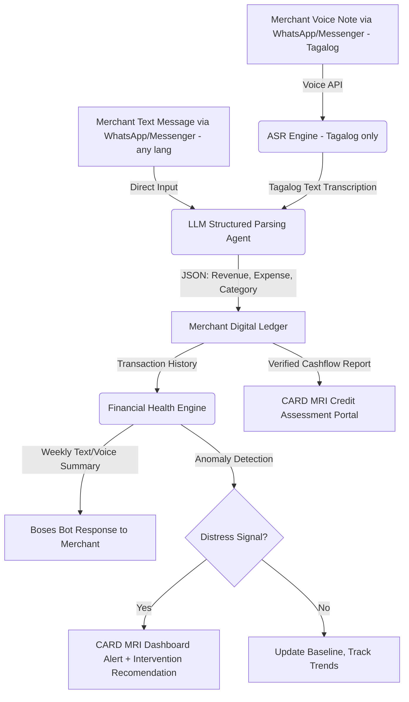

# Figma Jam Tab — Proposed Flow & Content Structure

*For the Boses concept presented to judges/organizers*

---

## 1. CORE PROBLEM (Top — most visible)

### The "Financial Invisibility" of Micro-Merchants

Sari-sari store owners are the backbone of Philippine micro-retail, yet **77.78% lack any formal record-keeping system**, relying on personal memory and verbal recall (Malinao, 2026). This financial invisibility locks them out of formal credit — FSPs cannot assess creditworthiness without data, so merchants default to "5-6" informal lenders at 20% interest per 2 months (Tutica, 2023).

**The gap is NOT willingness — it's the absence of a zero-friction tool that fits a 14-hour workday.** Paper ledgers are too slow, digital apps require literacy they don't have, and no existing tool connects merchant cashflow to FSP credit assessment.

#### Finverse Challenges Mapped (3)
| Challenge | How It Connects |
|---|---|
| **Resource Constraints — Limited Capacity for Data Analysis** | Micro-merchants have no time or training for bookkeeping. Paper ledgers fail. Digital apps require screen time and literacy they don't have. |
| **Data Quality — Inconsistent & Unreliable Data** | 77.78% rely on memory alone. Paper records prone to omission, loss, error. FSPs cannot trust self-reported histories. |
| **Insight Generation — Difficulty Applying Insights to Decisions** | Even if cashflow data existed, FSPs lack tools to translate merchant transaction history into credit decisions or early distress warnings. |

#### Supporting Data Points
- **77.78%** of micro-enterprises lack formal record-keeping (Malinao, 2026)
- **₱7,468** — average monthly net profit of rural PH micro-enterprises (Malinao, 2026)
- **~50%** of smallholders are "credit invisible" — no formal credit history (Jonnalagadda & Babu, 2026)
- **20% interest per 2 months** — loan sharks trap merchants in re-borrowing cycles (Tutica, 2023)
- **100% of sari-sari stores** face daily competition/pricing pressures; 80% struggle with cashflow (Caunan et al., 2025)

---

## 2. TARGET PARTNER

### CARD MRI (Philippines)

| Attribute | Detail |
|---|---|
| **Type** | Leading microfinance group in the Philippines |
| **Members** | ~8 million members, mostly rural women, micro-entrepreneurs, and farmers |
| **Why them** | Existing field officer network visiting villages regularly; already serves sari-sari store owners through micro-enterprise lending; has trust in underserved communities |
| **They already have** | Loan products for micro-merchants, field officer infrastructure, cooperative groups with transaction history, micro-insurance and micro-savings products |
| **What they lack** | A systematic way to capture merchant cashflow for better credit assessment; early warning system before defaults; digital tool that fits merchants' low-literacy, low-time reality |

---

## 3. THE SOLUTION — "Boses"

*(Boses = "voice" in Tagalog — frames the tool as a merchant's speaking companion, not another complex app)*

### Dual-Input Ledger System



### Three Layers

**1. Input Layer — Choice of Method**

Merchants can choose how they log transactions:

| Option | How It Works | Best For |
|---|---|---|
| **Voice Note** (Tagalog) | Speak naturally in Tagalog/Taglish. ASR transcribes → LLM parses | Busy hours, hands-free, prefer speaking |
| **Text Message** (any language) | Type a short message (Tagalog, English, Cebuano, mixed). LLM processes directly, no ASR | Noisy environments, non-Tagalog speakers |

> **Tagalog-First ASR**: Voice recognition is scoped to Tagalog only — production-ready models exist at <5% WER (Pascual et al., 2023). Other dialects are served by text input until ASR models mature. Fallback chain: full ASR → keyword spotting → text input toggle → officer call.

**2. Processing Layer — ASR + LLM Pipeline**

```
Merchant → Voice Note (Tagalog):
"Bumili ako ng tatlong case ng softdrinks, 900 piso lahat. Benta kahapon, 1,200."

OR Merchant → Text Message (any language):
"bought 3 case softdrinks 900 / benta kahapon 1200"

LLM Output → Structured JSON:
{
  "type": "expense",
  "category": "inventory",
  "item": "softdrinks",
  "quantity": 3,
  "unit": "case",
  "amount": 900,
  "currency": "PHP"
},
{
  "type": "revenue",
  "period": "yesterday",
  "amount": 1200,
  "currency": "PHP"
}
```

**3. Distress Detection Layer — FSP-Facing Intelligence**

The platform monitors merchant cashflow across the portfolio and flags distress signals:

| Signal | What It Means | CARD MRI Action |
|---|---|---|
| Revenue decline 2+ weeks | Cashflow stress, possible default risk | Trigger officer check-in, offer flexible repayment |
| Cash reserve < 1-week expenses | No emergency buffer | Activate micro-savings payout or short-term credit line |
| Consistent 3-month positive trend | Creditworthy, stable business | Auto-qualify for next loan tier or higher credit limit |
| No entry for 7+ days | Possible attrition or business disruption | Flag for officer follow-up |

---

## 4. WHY IT'S DIFFERENT

| Common Bookkeeping/Finance App | Boses |
|---|---|
| Forces one input method (typing) | **Choose your way** — voice note (Tagalog) or text (any language) |
| Requires digital literacy, app download | **Zero learning curve** — WhatsApp/Messenger, speak or type naturally |
| Merchant must self-motivate to log | Takes <15 seconds, fits into workday rhythm |
| Data stays with merchant | **Verified ledger** feeds into FSP credit assessment |
| Generic advice, no distress detection | **AI detects cashflow anomalies** and alerts FSP before default |
| Anonymous, no accountability | Merchant builds **financial health record** tied to coop membership |
| No institutional feedback loop | FSP sees **aggregate merchant trends** and can design better products |
| Requires stable internet | Works offline, syncs when connected |

---

## 5. SUPPORTING EVIDENCE (RRL)

### Sari-Sari Store Financial & Bookkeeping Practices

| Study | Key Finding | Implication for Boses |
|---|---|---|
| **Malinao (2026)** — *Ubay, Bohol, 18 micro-enterprises* | 77.78% lack formal record-keeping; rely on "Memory-Based Financial System." Monthly net profit mean ≈ ₱7,468. | **Direct support**: Core problem is empirically validated — merchants cannot track cashflow without a zero-friction tool. |
| **Layugan et al. (2026)** — *Laoag City, 319 sari-sari stores* | High accounting knowledge but only moderate practice application. Education and capitalization significantly influence financial performance. | **Supports**: Knowledge ≠ behavior. Boses removes the behavioral friction of manual entry, not just the knowledge gap. |
| **Caunan et al. (2025)** — *Bukidnon, 10 sari-sari stores* | 100% face daily competition/pricing pressures; 80% struggle with capital/cashflow; 90% report customer debt difficulties. | **Direct support**: Merchants need a tool that tracks real-time cashflow amidst daily chaos. Voice notes take <15 seconds. |
| **Bancoro et al. (2023)** — *Dumaguete City, 19 sari-sari stores* | 68% have monthly family income ≤ ₱10,000. Borrowing behavior varies (1-2x/year, ₱3K-10K+). Financial literacy at moderate level. | **Confirms**: Target market is low-income, credit-dependent. Boses lowers the literacy barrier to zero. |
| **Ordaneza et al. (2026)** — *Padada, Davao del Sur, 168 stores* | High financial management overall, but cash management scored lowest. Variation based on age, education, capital. | **Supports**: Cash management is the weakest pillar. Boses strengthens it through daily logging and automated visibility. |
| **Diaz et al. (2025)** — *Nueva Ecija, 182 entrepreneurs* | Bookkeeping knowledge positively correlated with tax compliance (ρ=0.48, p=0.001). Knowledge → better behavior. | **Direct support**: Better bookkeeping tools lead to better financial behavior and formalization. |

### ASR & Speech Recognition for Filipino Languages

> **Tagalog-First Scope**: All ASR studies focus on Tagalog/Filipino — production-grade Tagalog ASR exists at <5% WER. Other PH dialects lack production-ready models, so voice input is scoped to Tagalog only. Text input covers all other dialects.

| Study | Key Finding | Implication for Boses |
|---|---|---|
| **Pascual et al. (2023)** — *PH university research* | Best Filipino ASR: 4.37% WER (PS35). Bisaya ASR: 7.16% WER. | **Feasibility evidence**: Production-grade Tagalog ASR exists at <5% WER. |
| **De Goma et al. (2024)** — *Batangas accent* | Wav2Vec2.0 for Tagalog Batangueño: 18% WER, 90-100% word-level accuracy. | **Supports**: Even accented Tagalog ASR works well. Handles regional Tagalog variations. |
| **Dorado & Villanueva (2023)** — *Filipino children ASR* | DNN Filipino ASR: 1.49% WER (Jabra), outperforming Google (6.17%) and Whisper (11.28%). Latency 0.52s. | **Direct support**: Filipino ASR faster & more accurate than commercial alternatives. On-device inference possible. |

### Digital Bookkeeping & Technology Adoption in PH MSMEs

| Study | Key Finding | Implication for Boses |
|---|---|---|
| **Eduardo et al. (2024)** — *Jaen, Nueva Ecija, 30 MSMEs* | 50% unfamiliar with cloud accounting software. Hesitancy driven by expertise, security, change resistance. Peer recommendations strongly influence adoption. | **Direct support**: MSMEs resist complex tools. Boses removes complexity (voice only, no software). Deployment through trusted FSP leverages peer trust. |
| **Magnaye (2023)** — *Candelaria, Quezon, 50 SMEs* | Strong acceptance of computerized accounting. Portability and remote access rated highly. | **Supports**: Mobile/voice-based access aligns with what SME owners want — portability and ease. |

### Informal Lending & Micro-Enterprise Credit in PH

| Study | Key Finding | Implication for Boses |
|---|---|---|
| **Tutica (2023)** — *Capiz, 850 micro-enterprises* | Loan shark interest at 20% per 2 months. 74.6% plan to stay with loan sharks long-term despite knowing the cost. | **Direct support**: Status quo is broken. Merchants need an alternative data trail for formal credit. Boses builds that trail. |
| **Layaoen & Takahashi (2022)** — *National PH data* | Microfinance presence crowds out informal lending — but only when accessible. | **Supports**: If CARD MRI can assess creditworthiness through Boses data, merchants shift from informal to formal lending. |
| **Bermudez & Omotoy (2024)** — *Gonzaga, Cagayan, 53 vendors* | Informal credit is major contributor to financial generation for market vendors. Provides working capital, flexible terms. | **Confirms**: Merchants need accessible credit. Boses makes CARD MRI just as accessible as informal lenders. |

### Voice Privacy & Data Protection in PH

| Source | Key Finding | Implication for Boses |
|---|---|---|
| **NPC Advisory Opinion No. 2023-010** — *National Privacy Commission* | Voice recordings are personal data under the DPA. Consent required for collection and processing. Automated profiling subject to data subject rights. | **Regulatory baseline**: Opt-in consent, data minimization (discard raw audio after transcription), right to object to profiling. |

---

## 6. WHAT CARD MRI GETS (Metrics)

| Metric | Why It Matters |
|---|---|
| **Portfolio Risk Visibility** (HEADLINE) | See which merchants are declining before they miss a payment — no more blind lending |
| **Reduced Default Rate** | Early distress signals trigger intervention (flexible repayment, credit adjustment) before default |
| **Automated Underwriting** | Verified 3-month cashflow history replaces gut-feel loan approval — 2 days instead of 2 weeks |
| **Member Retention** | Merchants stay with the coop that helps them track finances and offers data-informed credit |
| **Aggregated Intelligence** | Stress trends across the merchant portfolio — design better products, detect community-level patterns |

---

## 7. DEMO PREVIEW (For Manila Finals)

```
WEEK 1 — ONBOARDING:
Maria (sari-sari store, 3 years) chooses her preferred input method.

Option A — Voice Note (Tagalog):
"Boses, benta ko kahapon 1,500. Bumili ako ng paninda 800."

Option B — Text Message (any language):
"benta 1500 kahapon / paninda 800"

Bot → Maria: "Welcome Maria! Recorded. Revenue: ₱1,500. 
       Expense: ₱800 (inventory). Net: ₱700. 
       Pwede kang mag-voice or mag-text next time, whatever mas madali sayo! 👍"

WEEK 4 — DISTRESS SIGNAL EMERGES:
Maria (prefers voice): "Mabagal benta ngayon. 500 lang kahapon. Wala masyado customer."

Bot → Maria: "Noted. Revenue: ₱500. No new purchases recorded. 
       Your revenue is down 58% from last week. 
       Want me to alert your CARD MRI officer?"

CARD MRI DASHBOARD — OFFICER VIEW:
⚠️ Maria's Store — Member #2041
┌─────────────────────────────────────┐
│ 📱 Last entry: Voice (Tagalog)      │
│ 💰 Revenue: down 40% for 2 weeks    │
│ 🏦 Cash reserve: ₱300               │
│    (< 1-week expense threshold)      │
│ 🗣️ Voice signal: "mabagal benta"    │
└─────────────────────────────────────┘

INTERVENTION CARD:
┌─────────────────────────────────────┐
│ 🔴 MODERATE-HIGH DISTRESS SIGNAL    │
│                                     │
│ Maria Santos - Sari-Sari Store      │
│ Location: Barangay San Jose         │
│ Revenue trend: ↓↓ 40% for 2 weeks   │
│ Cash reserve: ₱300 (< 1-week min)   │
│                                     │
│ Recommended:                        │
│ 1. Schedule officer visit this week │
│ 2. Offer 60-day payment moratorium  │
│ 3. Activate emergency credit line   │
│                                     │
│ [APPROVE] [DISMISS] [VIEW HISTORY]  │
└─────────────────────────────────────┘
```

---

## FIGMA JAM VISUAL LAYOUT PLAN

```
┌────────────────────────────────────────────────────────────────┐
│                   SECTION 1: CORE PROBLEM                       │
│  "Financial Invisibility"        │  3 Finverse Challenges      │
│  77.78% no formal records       │  mapped to icons             │
│  ₱7,468 avg monthly net         │  Data points in cards        │
├────────────────────────────────────────────────────────────────┤
│                     SECTION 2: TARGET PARTNER                   │
│              CARD MRI — Logo + Key Stats (~8M members)          │
├────────────────────────────────────────────────────────────────┤
│                   SECTION 3: SOLUTION — BOSES                    │
│  ┌──────────────┐  ┌──────────────────────┐  ┌──────────────┐  │
│  │ VOICE NOTE   │  │ ASR + LLM PIPELINE   │  │ LEDGER +     │  │
│  │ (Tagalog)    │→ │ Speech→Text→Structured│→ │ INSIGHTS     │  │
│  │ OR Text Msg  │  │ Data in < 3 seconds  │  │ + DISTRESS   │  │
│  │ (any lang)   │  └──────────────────────┘  │ DETECTION    │  │
│  └──────────────┘                            └──────────────┘  │
├────────────────────────────────────────────────────────────────┤
│               SECTION 4: WHY IT'S DIFFERENT                     │
│              Comparison table (common app vs Boses)              │
├────────────────────────────────────────────────────────────────┤
│  SECTION 5: RRL  │  SECTION 6: METRICS  │  SECTION 7: DEMO     │
│  Key studies in  │  Portfolio risk      │  Voice/text input    │
│  compact cards   │  visibility +        │  → Dashboard mockup  │
│                   │  reduced defaults   │  → Intervention card │
└────────────────────────────────────────────────────────────────┘
```

---

## Key Design Principles for the Figma Tab
1. **Scannable in 10 seconds** — judges skim first, read later
2. **Visual > Text** — use diagrams, tables, icons over paragraphs
3. **Problem then solution** — make them feel the pain of 77.78% record-less merchants before you pitch Boses
4. **One clear metric** — "Portfolio Risk Visibility" is the headline; everything supports it
5. **RRL in compact cards** — author + year + one-line takeaway, NOT full citations

---

## Full RRL References

### Sari-Sari Store Financial & Bookkeeping Practices

1. **Malinao RM** (2026). Financial Sustainability of Community-Based Micro-Enterprises: A Multi-Case Study on Informal Record-Keeping Among Sari-Sari Stores in a Rural Philippine Setting. *International Journal of Research and Innovation in Social Science*. https://doi.org/10.47772/ijriss.2026.100400474

2. **Layugan MG, Nening MR, Pascua KJ, Arconado P, Vila B, Baltazar HA, Macatumbas-Corpuz B** (2026). Accounting knowledge, practices, and financial performance of sari-sari stores: A descriptive-correlational study. *Divine Word International Journal of Management and Humanities*, 5(1), 3029-3060. https://doi.org/10.62025/dwijmh.v5i1.248

3. **Caunan BMC, Basoy Jr. RH, Benigay CFC, Escat VM, Pensahan DO** (2025). A Multiple Case Study on Challenges and Strategies of Sari-Sari Stores. *American Journal of Economics and Business Innovation*, 4(3), 213-224. https://doi.org/10.54536/ajebi.v4i3.6209

4. **Bancoro JCM, Jr BSV, Villanueva IT** (2023). Financial Attitude of Sari-Sari Store Owners in Barangay Batinguel Dumaguete City towards Microfinancing. *East Asian Journal of Multidisciplinary Research*, 2(4), 1749-1758. https://doi.org/10.55927/eajmr.v2i4.3822

5. **Ordaneza ES, Quilo AA, Buat SB, Geloca KMB** (2026). Financial Management Practices Among Sari-Sari Store Owners in Selected Barangay in Padada, Davao del Sur. *International Journal for Multidisciplinary Research*, 8(1). https://doi.org/10.36948/ijfmr.2026.v08i01.69493

6. **Diaz R, Natividad NC, Pascua IF** (2025). The nexus of bookkeeping and tax compliance: A knowledge and skills assessment of barangay micro-entrepreneurs. *Journal of Governance and Regulation*, 13(3). https://doi.org/10.55493/5008.v13i3.5609

### ASR & Speech Recognition for Filipino Languages

7. **Pascual RM, Azcarraga J, Cheng C, Ing JA, Wu J, Lim ML** (2023). Filipino and Bisaya Speech Corpus and Baseline Acoustic Models for Healthcare Chatbot ASR. *2023 IEEE International Conference on Electrical, Computer, Communications and Mechatronics Engineering (ICECCME)*. https://doi.org/10.1109/iceccme57830.2023.10253232

8. **De Goma JC, Alberto JRST, Antonio KIMC, San Pedro PC** (2024). Speech Recognition of Tagalog Talisay Batangueño Accent in the Philippines using Wav2Vec2.0. *2024 15th International Conference on E-Education, E-Business, E-Management and E-Learning (IC4E)*. https://doi.org/10.1145/3670013.3670031

9. **Dorado B, Villanueva A** (2023). Development of Low-Latency and Real-Time Filipino Children Automatic Speech Recognition System using Deep Neural Network. *2023 IEEE International Conference on Intelligent Systems Design and Financial Applications (ISDF)*. https://doi.org/10.1109/isdfs58141.2023.10131755

### Digital Bookkeeping & Technology Adoption in PH MSMEs

10. **Eduardo AML, Datu JG, Dela Cruz AD, Foster AS, de Leon CL** (2024). Barriers and Motivations for Cloud-Based Accounting Adoption Among Micro, Small, and Medium Enterprises (MSMEs) in Jaen, Nueva Ecija, Philippines. *International Journal of Advanced Engineering, Management and Science*, 10(6). https://doi.org/10.22161/ijaems.106.7

11. **Magnaye EG** (2023). Use of Computerized Accounting System of Small, Medium Enterprises in Candelaria, Quezon. *Acta Electronica Malaysia*, 7(2), 34-37. https://doi.org/10.26480/aem.02.2023.34.37

### Informal Lending & Micro-Enterprise Credit in PH

12. **Tutica JP** (2023). Effects of Loan-Sharking on Philippines' Microenterprises. *Zenodo*. https://doi.org/10.5281/zenodo.8226780

13. **Layaoen CWG, Takahashi K** (2022). Can microfinance lending crowd out informal lenders? Evidence from the Philippines. *Journal of International Development*, 34(2), 379-414. https://doi.org/10.1002/jid.3604

14. **Bermudez BO, Omotoy JF** (2024). Participation of Informal Credit Schemes to Finance Generation among Market Players in Gonzaga Cagayan. *Frontiers in Health Informatics*. https://www.healthinformaticsjournal.com/index.php/IJMI/article/view/1655

### Voice Privacy & Data Protection in PH

15. **National Privacy Commission** (2023). Advisory Opinion No. 2023-010 — Recording of Telephone Conversations and Consent under the Data Privacy Act. https://privacy.gov.ph/wp-content/uploads/2023/05/Advisory-Opinion-No.-2023-010.pdf
