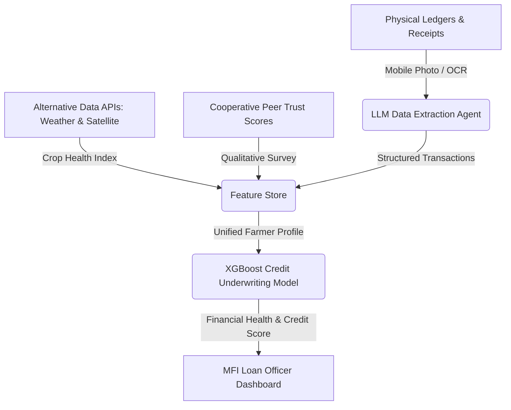

# 🌾 Idea 1: Alternative-Data Agri-Credit Scoring for Smallholders

Back to MOC: [[Hackathon MOC]]

## 📌 Quick Summary
An AI-driven mobile underwriting platform for community banks and agricultural cooperatives that digitizes physical receipts and ledger books, combining them with climate alternative data (weather, satellite crop indices) and subjective community trust inputs to evaluate creditworthiness for unbanked farmers.

---

## 🧩 Finverse Challenges Mapped
This idea directly addresses three critical Finverse data barriers:
1. **[[Finverse Data Access#Paper-based-collection|Paper-based data collection is difficult, expensive, and inconsistent]]**: Most farmers transact in cash and keep paper logs. Field agents waste hours transcribing them.
2. **[[Finverse Data Quality#Missing-Contextual-and-Subjective-Data|Missing Contextual and Subjective Data]]**: Standard credit systems ignore agricultural factors (e.g., soil health, rain trends) and community dynamics (e.g., cooperative participation).
3. **[[Finverse Insight Generation#Difficulty-Applying-Data-Insights|Difficulty Applying Data Insights to Decisions]]**: Cooperative banks want to lend but lack clear decision-support models for micro-loans.

---

## 🤝 Target Partner & User
- **Target Partner**: Community/Cooperative Banks or agricultural NGOs (e.g., **[[Partners/CARD MRI (Philippines)|CARD MRI]]** in the Philippines).
- **Target User**: Smallholder farmers (coconuts, rice, corn) and agricultural cooperative field officers.

---

## 💡 Tech & Data Architecture

### 1. The Mobile OCR Parser
- Field officers take pictures of farmers' hand-written records, receipts, and cooperative delivery vouchers.
- A lightweight, fine-tuned OCR engine (running locally or via a low-bandwidth API) processes the image, and a Small Language Model (SLM) extracts transaction dates, amounts, and descriptions, converting them into a structured database.

### 2. Climate & Agri-Data Enrichment
- Automatically fetches geographical indicators: historical weather patterns, soil moisture index, and satellite vegetation indices (NDVI) for the farmer's plot coordinates.
- Measures the farm’s climate risk resilience score.

### 3. Subjective Trust Integration
- Integrates qualitative indicators such as the farmer's attendance at cooperative meetings, group saving discipline, and peer-guarantor validations.

---

## ❤️ Financial Health Impact
- **Daily Management**: Gives farmers their first structured, digital overview of their cash flow (revenues vs. production costs).
- **Economic Resilience**: Allows rapid underwriting of micro-insurance and emergency credit to rebuild after typhoons or pest outbreaks, avoiding predatory local moneylenders (*"5-6"* lenders in the Philippines).
- **Long-term Planning**: Enables access to capital for purchasing modern machinery, high-yield seeds, or climate-resilient fertilizers.

---

## 🗺️ Connection & Open Questions
- **Synergies**: Can we combine this with parametric micro-insurance so the payout is automatically funneled into loan repayment? (See [[Idea 3 - Parametric Micro-Insurance Registry|Idea 3: Parametric Micro-Insurance]])
- **Next Steps**: Discuss with [[Partners/CARD MRI (Philippines)|CARD MRI]] regarding their current digitization efforts for rural cooperatives. What is the average bandwidth available to field officers?
