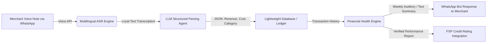

# 🏪 Idea 2: Voice-Led Micro-Ledger for Informal Retailers

Back to MOC: [[Hackathon MOC]]

## 📌 Quick Summary
A WhatsApp/Viber-based AI voice assistant that enables cash-only micro-merchants (e.g., Sari-Sari stores, Warungs) to perform effortless bookkeeping through spoken voice notes in local languages, automatically structuring their cash flow and serving back financial health analysis.

---

## 🧩 Finverse Challenges Mapped
This idea targets three core challenges in the Finverse list:
1. **[[Finverse Resource Constraints#Limited-Capacity-for-Data-Analysis|Limited Capacity for Data Analysis]]**: Micro-retailers operate on razor-thin margins and have neither the time nor the training to analyze spreadsheet ledgers.
2. **[[Finverse Data Quality#Inconsistent-&-Unreliable-Data|Inconsistent & Unreliable Data]]**: Paper bookkeeping is prone to omission, errors, and loss, leading to inaccurate representations of business health.
3. **[[Finverse Insight Generation#Complexity-in-Measuring-Financial-Health|Complexity in Measuring Financial Health]]**: FSPs cannot easily determine if a microfinance candidate is running a profitable business or merely recycling capital.

---

## 🤝 Target Partner & User
- **Target Partner**: Mission-driven fintech platforms, e.g., **[[Partners/Amartha (Indonesia)|Amartha]]** or regional MFIs.
- **Target User**: Sari-sari store owners (Philippines), Warung owners (Indonesia), street food vendors, and market merchants who run solo operations.

---

## 💡 Tech & Data Architecture



### 1. The Multilingual Voice Interface
- Merchants use their platform of choice (WhatsApp, Viber, Line) to send short voice memos.
- The voice recognition engine supports low-resource languages and regional slang (e.g., Taglish, Javanese, conversational Bahasa Indonesia).

### 2. LLM Parser & Structured Bookkeeping
- A prompt-engineered LLM processes the transcribed text to isolate financial variables:
  * **Intent**: Income vs. Expense vs. Debt Collection.
  * **Entity Extraction**: Item name, quantity, category, and total currency.
- *Example*: `"Bumili ako ng tatlong case ng softdrinks kanina, 900 pesos lahat."` (Bought three cases of soft drinks earlier, 900 pesos total) gets structured as:
  ```json
  {
    "type": "expense",
    "category": "inventory",
    "item": "softdrinks",
    "quantity": 3,
    "unit": "case",
    "amount": 900,
    "currency": "PHP"
  }
  ```

### 3. Automated Financial Insights
- The system checks for cash reserve safety (e.g., warning if emergency cash drops below weekly average expenses).
- It generates friendly voice/text advice: *"Sari, you spent 20% more on inventory this week, but sales are up 5%. Your net profit is 1,200 PHP. Don't forget to set aside 100 PHP for your weekly cooperative savings target!"*

---

## ❤️ Financial Health Impact
- **Daily Management**: Extremely low-friction bookkeeping. Eliminates manual log writing at the end of a exhausting 14-hour shift.
- **Financial Security**: Provides visibility into exact profit margins, helping merchants stop underpricing their goods.
- **Long-term Planning**: The verified transaction ledger can be shared directly with micro-lenders to secure business expansion credit at fair rates.

---

## 🗺️ Connection & Open Questions
- **Synergies**: Can this ledger flow directly into a micro-lender's credit-scoring engine? (See [[Idea 1 - Alt-Data Credit Scoring for Farmers|Idea 1: Alt-Data Credit Scoring]])
- **Next Steps**: Validate ASR accuracy on Tagalog/Bahasa speech under noisy environments (like busy markets). Can we run a prototype using open-source Whispers or Google Speech-to-Text APIs?
- **Partner Fit**: Connect with [[Partners/Amartha (Indonesia)|Amartha]] who already service over 1.6 million micro-merchants in rural Indonesia.
