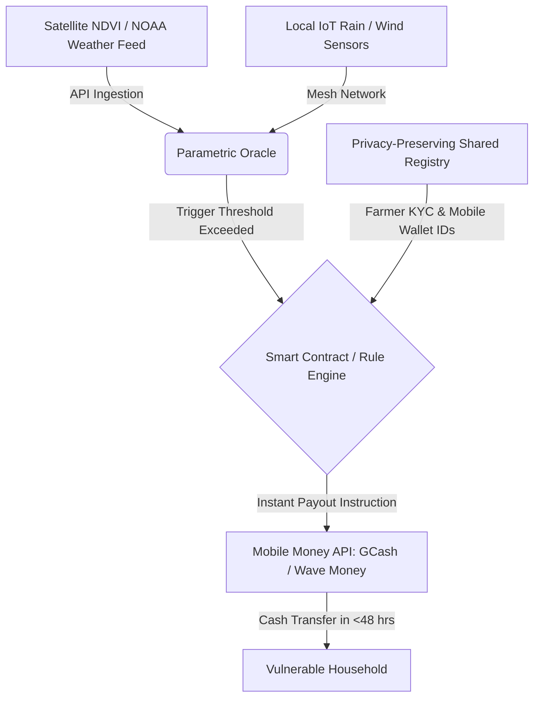

# 🌦️ Idea 3: Parametric Micro-Insurance Registry & Alert System

Back to MOC: [[Hackathon MOC]]

## 📌 Quick Summary
A data-sharing registry that connects environmental sensors and satellite data to micro-insurance providers, enabling automatic, instant parametric payouts to vulnerable coastal and agricultural communities immediately after climate shocks, without requiring physical damage assessment.

---

## 🧩 Finverse Challenges Mapped
This idea targets data barriers that prevent fast, regional safety nets:
1. **[[Finverse Data Access#Trust-Deficit-&-Low-Incentives-for-Data-Sharing|Trust Deficit & Low Incentives for Data Sharing]]**: Insurance companies, agricultural agencies, and NGOs rarely share data due to proprietary and privacy fears.
2. **[[Finverse Data Access#Limited-Data-Availability-&-Accessibility|Limited Data Availability & Accessibility]]**: High-resolution weather history and geographic hazard mapping are locked in government agencies or scientific databases.
3. **[[Finverse Resource Constraints#Lack-of-Timely-or-Granular-Data|Lack of Timely or Granular Data]]**: Standard claims require physical inspectors to visit damaged remote farms, taking weeks or months.

---

## 🤝 Target Partner & User
- **Target Partner**: NGO coalitions, regional microinsurance providers (e.g., CARD Pioneer Microinsurance), or public-sector disaster management bodies.
- **Target User**: Coastal fisherfolk, low-income farmers, and rural community cooperatives in high-risk climate zones (e.g., Vietnam's Mekong Delta, coastal Philippines, or Bangladesh).

---

## 💡 Tech & Data Architecture

### 1. The Parametric Rule Engine (Oracle)
- Instead of assessing crop damage manually, payouts are triggered by objective index metrics:
  * **Wind Speed**: Typhoon wind speeds exceeding 120 km/h in the coordinate polygon.
  * **Rainfall**: Rainfall deficit (drought) or cumulative rainfall exceeding 300mm in 24 hours (flood).
- Feeds are pulled from public climate API engines (e.g., Coprenicus, NOAA) and validated against local IoT weather station arrays.

### 2. Privacy-Preserving Registry
- A shared database built using hashing or light cryptographic access control.
- Allows NGOs to register vulnerable families and map their geographical plots, while insurance companies underwrite them, without either party exposing the full PII (Personally Identifiable Information) to third parties.

### 3. Automated Mobile Money Payouts
- Directly interfaces with dominant regional wallets (e.g., **GCash** in the Philippines, **Wave Money** in Myanmar, **bKash** in Bangladesh) to disburse funds.

---

## ❤️ Financial Health Impact
- **Absorb Shocks (Resilience)**: Payouts arrive in hours, not months. Families can purchase emergency supplies, food, and seeds to restart immediately, preventing them from selling vital assets (like farm animals or tools) to survive.
- **Financial Security**: Restores faith in the financial safety net. Payouts are transparent and binary (based on physical data rules), eliminating claim rejection disputes.

---

## 🗺️ Connection & Open Questions
- **Synergies**: Can agricultural alternative data collected in [[Idea 1 - Alt-Data Credit Scoring for Farmers|Idea 1]] be used to customize the parametric thresholds for individual farms?
- **Next Steps**: Locate public satellite databases for APAC. How granular can we get with free satellite data (e.g., Sentinel-2)?
- **Partner Fit**: **[[Partners/PRADAN (India)|PRADAN]]** works with self-help groups in high-risk climatic areas in India, making them a strong partner candidate.
