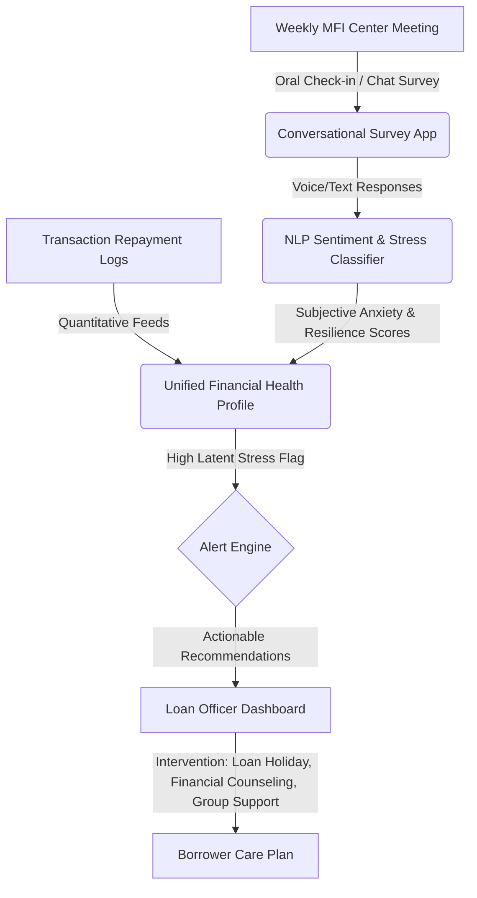

# 🧠 Idea 4: Subjective Financial Well-being & Stress Tracker

Back to MOC: [[Hackathon MOC]]

## 📌 Quick Summary
A qualitative diagnosis tool for microfinance loan officers that uses conversational surveys and NLP sentiment analysis to capture borrowers' subjective financial anxiety, sense of security, and household dynamics, helping FSPs tailor loan terms to prevent over-indebtedness.

---

## 🧩 Finverse Challenges Mapped
This idea addresses the limitations of purely quantitative data:
1. **[[Finverse Data Quality#Missing-Contextual-and-Subjective-Data|Missing Contextual and Subjective Data]]**: Traditional FSPs only track numbers (balances, loan defaults) and miss qualitative realities like domestic financial abuse, stress, and anxiety.
2. **[[Finverse Insight Generation#Complexity-in-Measuring-Financial-Health|Complexity in Measuring Financial Health]]**: Financial health is inherently subjective. A farmer earning $5/day with high community support might be "healthier" than an urban merchant earning $20/day with massive debt stress.
3. **[[Finverse Insight Generation#Difficulty-Applying-Data-Insights|Difficulty Applying Data Insights to Real-World Decisions]]**: Translating credit risk calculations into supportive, real-world customer interventions (e.g., restructured payment plans before default).

---

## 🤝 Target Partner & User
- **Target Partner**: Traditional Microfinance Institutions (MFIs) that operate through local credit officers and physical community group meetings (e.g., **[[Partners/CARD MRI (Philippines)|CARD MRI]]** or **[[Partners/PRADAN (India)|PRADAN]]**).
- **Target User**: Loan officers conducting weekly group meetings (center meetings) and rural borrowers.

---

## 💡 Tech & Data Architecture

### 1. The Conversational Survey Interface
- Built as a quick, 3-minute voice or tap-based interactive quiz.
- Uses cultural metaphors instead of complex terminology (e.g., in the Philippines, asking about *“kaginhawaan”*—a holistic sense of well-being/ease—rather than "liquidity").

### 2. NLP Sentiment Analysis
- Analyzes voice-note responses to qualitative questions:
  * *"How did you feel about your household finances this week?"*
  * *"Do you worry about the next loan payment?"*
- Detects indicators of distress (hesitation, stress-associated vocabulary, vocal pitch shifts if voice-recorded) to calculate a **Subjective Stress Index**.

### 3. Actionable Intervention Decision Engine
- If a client has 100% repayment rate (looks "good" on paper) but high Subjective Stress (feels overwhelmed), the system triggers:
  * An automated offer to snooze next week's payment (loan holiday).
  * Auto-enrollment in a micro-savings matching program.
  * A prompt for the loan officer to check in on household financial safety during their next visit.

---

## ❤️ Financial Health Impact
- **Financial Security & Control**: Directly measures and aims to reduce the mental tax of debt. Restores a sense of control.
- **Daily Management**: Encourages reflection. Regular check-ins build mindfulness around cash usage and household sharing.
- **Resilience**: Prevents debt traps and predatory cycling of loans (borrowing from one MFI to pay another).

---

## 🗺️ Connection & Open Questions
- **Synergies**: Can we combine this with the voice-led ledger from [[Idea 2 - Voice-Led Ledger for Micro-Merchants|Idea 2]]? If the ledger detects a dip in revenue, it can trigger this subjective stress survey.
- **Ethics & Privacy**: Subjective data is highly personal. How do we ensure this data isn't weaponized by lenders to deny services, but is instead used strictly for supportive interventions?
- **Partner Fit**: MFIs like **[[Partners/CARD MRI (Philippines)|CARD MRI]]** prioritize social development metrics alongside financial metrics, making them a perfect testbed.
