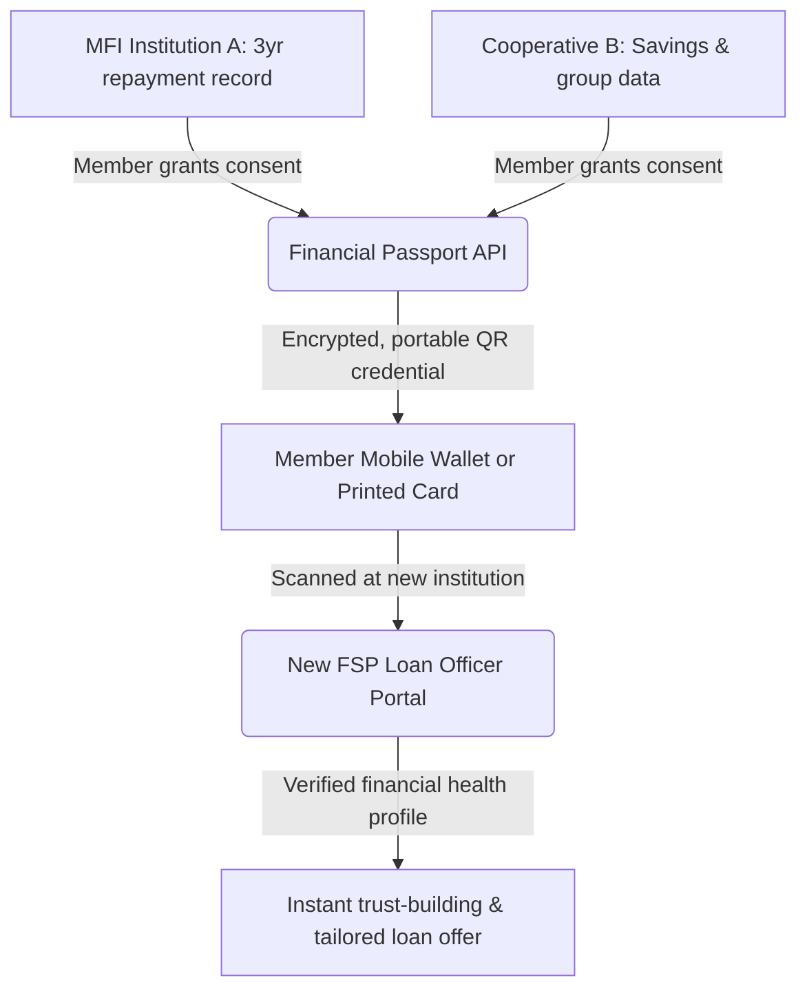

# 🪪 Idea 5: Portable Financial Identity Passport for Cooperative Members

Back to More Ideas: [[More Ideas Index|More Ideas Index]] | Back to MOC: [[Hackathon MOC]]

## 📌 Quick Summary
A privacy-first, member-controlled digital "Financial Passport" that stores a borrower's verified credit history, repayment record, and financial health scores across multiple cooperatives and MFIs — so they don't have to start from zero each time they move to a new institution or region.

---

## 🧩 Finverse Challenges Mapped
1. **[[Finverse Data Quality#Fragmented-&-Disconnected-Systems|Fragmented & Disconnected Systems]]**: A borrower who has a perfect 5-year repayment record at CARD MRI cannot use that history when applying at a new cooperative in a different province. Every system is siloed.
2. **[[Finverse Data Access#Trust-Deficit-&-Low-Incentives-for-Data-Sharing|Trust Deficit & Low Incentives for Data Sharing]]**: Cooperatives guard member data jealously. There is no neutral, member-owned layer to carry this data between institutions.
3. **[[Finverse Insight Generation#Difficulty-Applying-Data-Insights|Difficulty Applying Insights to Real-World Decisions]]**: Without portable history, loan officers make gut-feel decisions on new applicants they have no data on — increasing risk and interest rates.

---

## 🤝 Target Partner & User
- **Target Partner**: Cooperative bank federations, rural bank networks, or regulatory bodies (e.g., the Bangko Sentral ng Pilipinas CreditCheck initiative).
- **Target User**: Seasonal agricultural workers, OFW (Overseas Filipino Workers) dependents, or families who move between provinces for livelihood reasons and need to rebuild trust at new institutions.

---

## 💡 Tech & Data Architecture

### 1. Member-Controlled Consent Layer
- The borrower owns the passport. They decide which institutions can read it and which portions to share (e.g., sharing repayment score but not hiding savings amounts).
- Built around APAC's evolving data consent frameworks (India's Account Aggregator, Philippines' DPA, Indonesia's PDP Law).

### 2. Verified Credential Architecture
- Leverages **Verifiable Credentials (VCs)**, a W3C open standard. Each institution digitally signs the data it contributes (e.g., "CARD MRI certifies: 48 consecutive on-time payments").
- The passport is a bundle of these signed credentials, readable via a QR code or lightweight NFC tap, even offline.

### 3. FSP Intake Dashboard
- The receiving institution's loan officer scans the passport and is shown a clean, unified financial health dashboard — no need to build their own scoring model.

---

## ❤️ Financial Health Impact
- **Daily Management**: Enables faster access to micro-credit at fair rates since history can be proven, reducing reliance on predatory lenders while waiting to "build" trust.
- **Financial Security**: Migrants and seasonal workers no longer lose their financial identity when they move. They arrive at a new institution with a verified record, not as a stranger.
- **Long-term Planning**: A multi-year portable credit history enables access to larger, longer-term loans for assets like home renovation or farming machinery.

---

## 🗺️ Connection & Open Questions
- **Synergies**: The ledger data generated by [[Idea 2 - Voice-Led Ledger for Micro-Merchants|Idea 2: Voice-Led Ledger]] could feed directly into this passport as a self-reported data layer.
- **Regulatory Check**: Which APAC jurisdictions already have open finance or account aggregator frameworks we can build on? Philippines, India (AA framework), Thailand (Open Banking)?
- **Risk**: Credential forgery. How do we ensure that scanned QR passports cannot be counterfeited or re-used by someone else?
