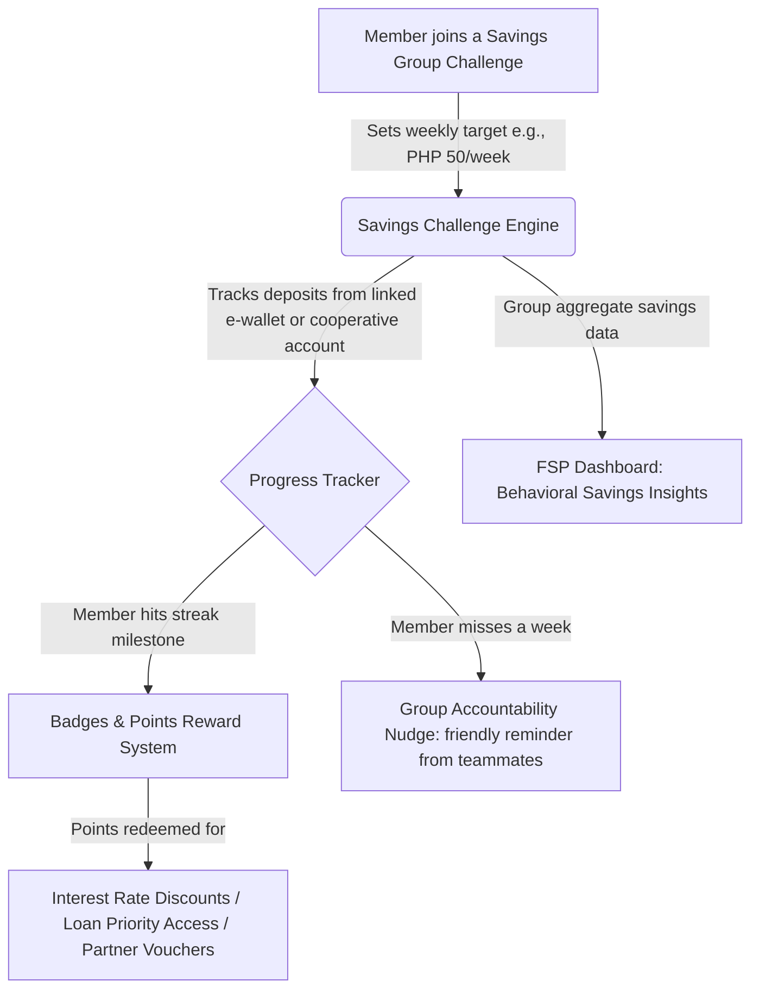

# 🎮 Idea 6: Community Savings Challenge — Gamified Group Savings for Youth & Families

Back to More Ideas: [[More Ideas Index|More Ideas Index]] | Back to MOC: [[Hackathon MOC]]

## 📌 Quick Summary
A group savings mobile platform modeled on popular social mechanics (streaks, leaderboards, team challenges) that nudges low-income families and youth in APAC to build emergency savings habits through friendly community competition and shared accountability — embedded directly into cooperative or MFI apps.

---

## 🧩 Finverse Challenges Mapped
1. **[[Finverse Insight Generation#Complexity-in-Measuring-Financial-Health|Complexity in Measuring Financial Health]]**: Emergency savings levels are one of the most critical yet hardest-to-track financial health indicators. Most MFIs only track loan repayment, not savings behavior.
2. **[[Finverse Resource Constraints#Limited-Capacity-for-Data-Analysis|Limited Capacity for Data Analysis]]**: Cooperatives rarely have dedicated savings education programs and cannot afford professional financial literacy coaching for every member.
3. **[[Finverse Insight Generation#Difficulty-Applying-Data-Insights|Difficulty Applying Insights to Real-World Decisions]]**: Knowing a member has zero emergency savings is not enough; FSPs need behavioral tools to actually change savings patterns.

---

## 🤝 Target Partner & User
- **Target Partner**: Savings and credit cooperatives (SACCOS), rural cooperative banks, or youth-focused NGOs with mobile platforms.
- **Target User**: Members aged 18–35 years old in cooperative groups or savings circles who already have mobile phones but haven't built formal savings habits. Also targets parents saving for school fees.

---

## 💡 Tech & Data Architecture

### 1. The Group Challenge Engine
- Members form "savings squads" of 5–10 people (e.g., neighbors, cooperative center meetings, office-mates).
- Each squad picks a shared goal (e.g., *"Emergency Fund Challenge: PHP 5,000 in 12 weeks"*).
- The app visualizes the whole group's progress like a shared progress bar or collaborative game map.

### 2. Behavioral Nudge System
- Uses **commitment devices**: members publicly commit to a savings target, which activates social accountability pressure.
- If a member breaks a streak, the system sends a friendly peer message (not a bank notification) from a squad member to check in.
- Weekly narrative stories are served in local languages: *"Maria saved 3 weeks straight — her family can now handle a ₱3,000 medical emergency without borrowing."*

### 3. Rewards & Incentive Layer
- Savings milestones unlock tangible FSP rewards: reduced loan interest rates, priority access to credit products, or partner merchant discount vouchers (e.g., 10% off at local agri-suppliers).
- Data on consistent savers is fed to the FSP's loan underwriting team as a positive behavioral signal.

---

## ❤️ Financial Health Impact
- **Shock Absorption (Resilience)**: The primary goal is building a 3-month emergency cash buffer — the most protective financial safety net against medical bills, natural disasters, and job loss.
- **Daily Management**: Teaching the habit of setting aside a fixed weekly amount transforms ad-hoc, irregular savings into structured behavioral patterns.
- **Financial Security**: The social accountability layer reduces the isolation and anxiety of saving alone, making the process feel communal and motivating rather than a chore.

---

## 🗺️ Connection & Open Questions
- **Synergies**: The savings data generated here can feed into the [[Idea 1 - Alt-Data Credit Scoring for Farmers|Idea 1: Alt-Data Credit Scoring]] model as a behavioral savings score.
- **Game Design Risk**: If the gamification feels childish or patronizing to adult members, it will be rejected. Design must be culturally sensitive — not Western-app-style, but community-narrative-driven (e.g., cooperative journey metaphors, not points-and-badges from gaming apps).
- **Partner Fit**: Any FSP with a digital app can integrate this as a module — no need to build a standalone platform from scratch.
