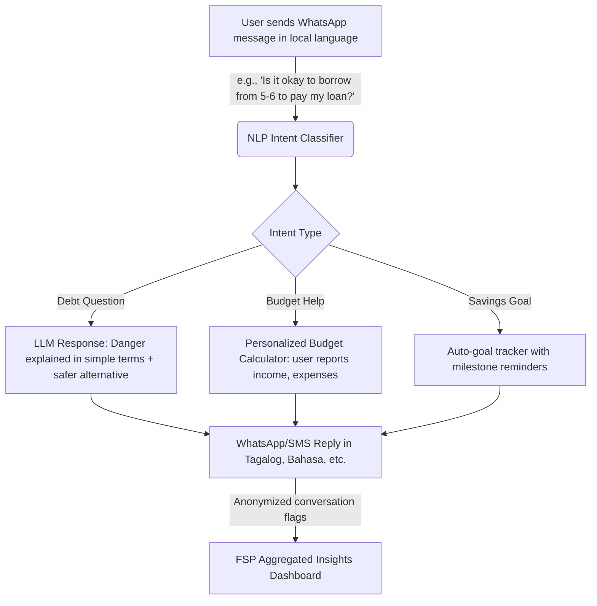

# 🤖 Idea 7: AI Financial Coach — Plain-Language Money Advisor for Low-Income Households

Back to More Ideas: [[More Ideas Index|More Ideas Index]] | Back to MOC: [[Hackathon MOC]]

## 📌 Quick Summary
A conversational AI assistant — accessible via SMS, WhatsApp, or a basic feature phone — that acts as a non-judgmental, 24/7 financial coach for low-income households. It answers money questions in plain, local-language conversational text, gives personalized budgeting advice based on the user's own reported income, and flags when a financial decision may be harmful (e.g., taking a high-interest loan to pay off another loan).

---

## 🧩 Finverse Challenges Mapped
1. **[[Finverse Resource Constraints#Limited-Capacity-for-Data-Analysis|Limited Capacity for Data Analysis]]**: FSPs cannot afford to hire one human financial counselor per borrower. An AI coach scales this 1-to-1 relationship to thousands of members simultaneously.
2. **[[Finverse Data Quality#Missing-Contextual-and-Subjective-Data|Missing Contextual and Subjective Data]]**: People rarely feel comfortable asking their loan officer "is this a good idea?" because of power dynamics. A neutral AI coach removes this judgment barrier and captures real financial concerns.
3. **[[Finverse Insight Generation#Difficulty-Applying-Data-Insights|Difficulty Applying Insights to Real-World Decisions]]**: Traditional financial literacy programs are one-size-fits-all workshops. This coach is personalized, contextual, and available at the exact moment of financial decision-making.

---

## 🤝 Target Partner & User
- **Target Partner**: Any FSP with a large loan portfolio who wants to reduce default rates by improving borrower financial decision-making. Especially NGO-MFIs whose mission explicitly includes financial education (e.g., **[[Partners/PRADAN (India)|PRADAN]]**).
- **Target User**: Borrowers who are first-generation formal finance users with little financial literacy — particularly women-headed households who are the primary financial managers but have historically had less education access.

---

## 💡 Tech & Data Architecture

### 1. The Conversational Interface — Meet People Where They Are
- Operates on **WhatsApp, Viber, SMS, or even voice calls for feature phones** — no app download required.
- The LLM is prompted to respond in the exact dialect and literacy level of the user, using culturally familiar analogies.
- *Example interaction*:
  > 👤 **User**: "Pwede bang mangutang ulit para mabayaran yung utang ko sa cooperative?" *(Is it okay to borrow again to pay my cooperative debt?)*
  > 
  > 🤖 **Coach**: "Huwag muna. Pag nangutang ka para bayaran ang utang, lumalaki pa ang utang mo dahil sa interest. Mas mainam na kausapin ang iyong cooperative officer para sa restructured payment plan. Gusto mo bang tulungan kitang mag-compose ng mensahe para sa kanila?" *(Not yet. If you borrow to pay debt, your total debt grows because of interest. It's better to talk to your cooperative officer for a restructured payment plan. Want me to help you draft a message to them?)*

### 2. Personalized Budgeting Engine
- Asks guided questions to understand the user's income and expense categories (e.g., food, transport, school fees, loan repayments).
- Generates a simple weekly budget summary and flags when spending exceeds safe thresholds.
- Over time, it learns patterns and proactively warns: *"Last month when school season started, you spent 40% more. Preparation tip: start setting aside PHP 200/week now."*

### 3. FSP Aggregate Insights Layer
- Fully anonymized conversations are analyzed to surface aggregated signals to the FSP: What are members most commonly worried about? What harmful financial behaviors are most prevalent in which barangays?
- This becomes a qualitative intelligence feed for FSP program design decisions.

---

## ❤️ Financial Health Impact
- **Daily Management**: Provides a personalized sounding board for day-to-day decisions — reducing impulsive financial choices driven by fear or confusion.
- **Financial Security**: By intercepting harmful debt spirals in real-time (e.g., the 5-6 moneylender trap), it prevents the single most common cause of financial catastrophe among rural borrowers.
- **Long-term Planning**: The savings goal tracker and personalized milestones nudge users toward future-orientation — a mindset shift that is the foundation of long-term financial health.

---

## 🗺️ Connection & Open Questions
- **Synergies**: The coach can act as the friendly front-end for both [[Idea 2 - Voice-Led Ledger for Micro-Merchants|Idea 2: Voice-Led Ledger]] (ledger data fed into budget advice) and [[Idea 4 - Subjective Well-being Tracker|Idea 4: Stress Tracker]] (stress flags surfaced through conversations).
- **Hallucination Risk**: LLMs can give incorrect financial advice. All outputs must be validated against a curated financial literacy knowledge base specific to APAC regulatory frameworks.
- **Language Richness**: Low-resource dialects (e.g., Cebuano, Ilocano, Maguindanaon) are underrepresented in LLM training data. Fine-tuning or retrieval-augmented generation with local corpora is essential.
