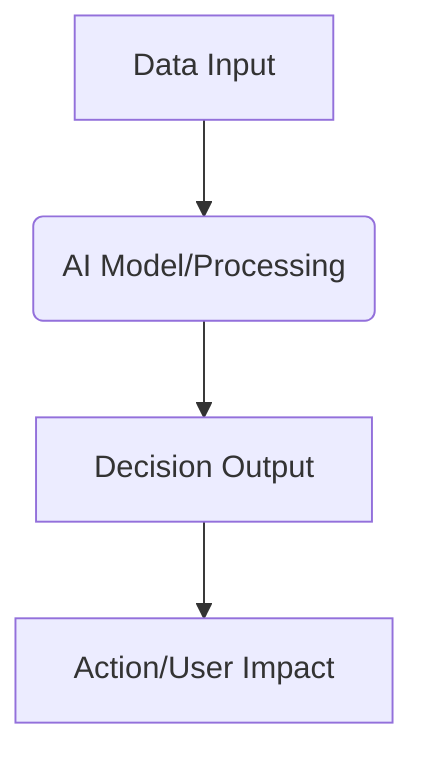

# 💡 Concept Title: [Name of Your Concept]

Back to MOC: [[Hackathon MOC]]

## 📌 Quick Summary
*A 1-2 sentence description of what the solution is, who it is for, and the technology it uses.*

---

## 🧩 Finverse Challenges Mapped
*Select up to 3 challenges from data.org's Finverse list. Briefly explain how this concept addresses them.*
1. **[[Finverse Data Access#Specific-Challenge|Finverse Challenge Name]]**: Explanation...
2. **[[Finverse Data Quality#Specific-Challenge|Finverse Challenge Name]]**: Explanation...
3. **[[Finverse Resource Constraints#Specific-Challenge|Finverse Challenge Name]]**: Explanation...

---

## 🤝 Target Partner & User
- **Target Partner**: *What type of FSP? E.g., [[Partners/CARD MRI (Philippines)|CARD MRI]] or general rural cooperative banks.*
- **Target User**: *Who is the end user? E.g., micro-merchants, local farmers, rural families.*

---

## 💡 Tech & Data Architecture
*Explain how the data flows, what AI/data models are used, and how it is implemented.*

- **Data Capture**: *How is data accessed or collected?*
- **AI/ML/Data Model**: *What data models or algorithms are used?*
- **Interface**: *How does the user interact with the tool?*

---

## ❤️ Financial Health Impact
*Detail how this project improves the 4 pillars of Financial Health:*
- **Daily Management**: *How does it improve daily cash flow control?*
- **Economic Resilience**: *How does it help absorb financial/economic shocks?*
- **Long-term Planning**: *How does it help plan for future milestones?*
- **Financial Security**: *How does it make them feel safe and in control?*

---

## 🗺️ Connection & Open Questions
- **Synergies**: *Does this connect to other ideas? (e.g., [[Idea 1 - Alt-Data Credit Scoring for Farmers|Idea 1]])*
- **Open Risks/Questions**: *What technical or policy obstacles exist?*
- **Next Steps**: *What action items are needed to validate this?*
