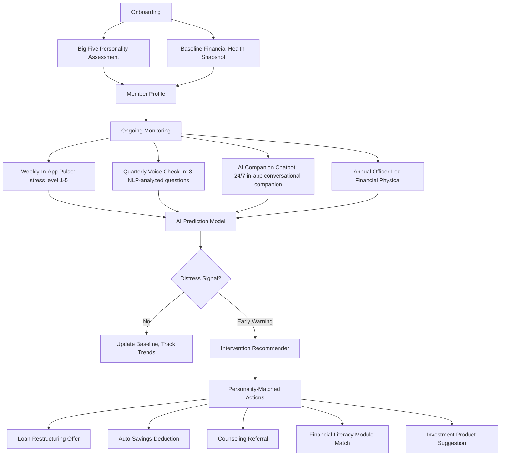

# Figma Jam Tab — Proposed Flow & Content Structure

*For the Alagad concept presented to judges/organizers*

---

## 1. CORE PROBLEM (Top — most visible)

### The "Loandon" Debt Cycle

Public school teachers (elem to senior high) and college professors in the Philippines face a silent financial health crisis. Despite stable government salaries, they are chronically trapped in debt cycles coined **"Loandon"** — a play on "London" describing the exhausting journey from one loan to the next (Galicia et al., 2025).

**The gap is NOT knowledge — it's behavioral.** Teachers score high on financial literacy tests but still fall into debt traps because no system exists to catch distress early and intervene before they take another high-interest loan.

#### Finverse Challenges Mapped (3)
| Challenge | How It Connects |
|---|---|
| **Missing Contextual & Subjective Data** | FSPs see repayment history but not the teacher's financial stress, personality-driven spending patterns, or subjective well-being |
| **Complexity in Measuring Financial Health** | Financial health is multi-dimensional — no single metric captures the full picture |
| **Difficulty Applying Insights to Decisions** | Even if FSPs had this data, they lack decision-support tools to turn insight into helpful intervention |

#### Supporting Data Points
- **₱319 billion** — total outstanding loans among DepEd personnel (Damolo et al., 2026)
- **~50%** of teachers report borrowing merely to cover daily expenses (PNU Research, 2023)
- **High literacy, but low debt management** — teachers know *what* to do, but lack behavioral scaffolding (Borres, 2023)
- **Health emergencies (45.8%)** and **daily expenses (41.4%)** top reasons teachers borrow (PNU Research, 2023)

---

## 2. TARGET PARTNER

### University of Mindanao Cooperative

| Attribute | Detail |
|---|---|
| **Type** | Teachers' & professors' cooperative |
| **Members** | Elementary to senior high school teachers + college professors |
| **Why them** | Existing trust relationship, salary deduction arrangements, field officer network, sees the debt cycle daily |
| **They already have** | Loan products, savings programs, member touchpoints, cooperative meeting infrastructure |
| **What they lack** | A system to detect distress *before* default, personality-matched product recommendation, proactive member engagement tools |

---

## 3. THE SOLUTION — "Alagad"

*(Alagad = "guardian/caregiver" in Tagalog — frames the FSP as a guardian, not a collector)*

### Hybrid Check-Up System



### Four Layers

**1. Onboarding (One-Time)**
- 5-minute Big Five personality assessment (validated, public domain — IPIP)
- Baseline financial health snapshot from UM Cooperative records
- ~7 min total

**2. Ongoing Monitoring (Multi-Channel, Low-Friction)**

| Cadence | Method | What's Collected |
|---|---|---|
| **Weekly** | In-app message | "How stressed are you about money? Tap 1-5" |
| **Quarterly** | Voice check-in via app | 3 questions: financial health score, debt burden, goal progress |
| **24/7 On-Demand** | AI Companion Chatbot (inside Alagad app) | Open-ended conversations, expressed concerns, emotional tone, unsolicited distress signals |
| **Annually** | Officer-led "financial physical" | 10-min structured review during scheduled visit |

**3. AI Companion Chatbot — 24/7 Member-Facing Layer**

Always available inside the Alagad app. Beyond FAQ — it's a personality-aware financial companion.

| What It Does | How It Works |
|---|---|
| **Check financial status** | Reads member's current stress trend, DTI, savings progress | "You're doing okay — your stress has been stable. Want to see your savings progress?" |
| **Dump money worries** | Listens to open-ended concerns, runs NLP sentiment | Member: "I'm so stressed about my loan due next week." Chatbot flags distress → feeds into AI prediction model |
| **Ask questions** | Answers financial literacy questions in plain local language | "Is it okay to borrow from 5-6 to pay my coop loan?" → Chatbot: "Not yet. Let me show you safer options." |
| **Surface interventions** | Routes recommendations before the officer call | "I notice your stress has been rising. Would you like me to show you loan restructuring options?" |

**4. AI Prediction Layer — Distress Detection + Intervention**
- **Model**: Gradient-boosted ensemble (CatBoost/LightGBM)
- **Target**: Probability of financial distress within next 3 months
- **Features**: Big Five traits + stress trend + debt-to-income trajectory + check-in consistency + chatbot sentiment signals + expressed concern frequency
- **Output**: Personality-matched recommendations, not just risk scores

#### Intervention Examples
| Profile | Signal | Recommended Action |
|---|---|---|
| High neuroticism + rising stress | Stress 4/5, DTI increased 15% | Loan restructuring + counseling referral |
| Low conscientiousness + missed streak | 3 missed savings weeks | Auto-deduct 3% of salary before it hits account |
| High openness + healthy profile | Stable DTI, low stress | Suggest investment or savings product |
| High agreeableness + multiple loans | 3 active loans, struggling to say no | Flag officer for check-in, discuss consolidation |

---

## 4. WHY IT'S DIFFERENT

| Typical Budgeting/Wellness App | Alagad |
|---|---|
| Relies on user self-motivation | **Mandatory check-in** built into cooperative membership |
| One-size-fits-all advice | **Personality-matched** interventions (what works for high-conscientiousness won't work for high-neuroticism) |
| Direct-to-consumer (must acquire users) | **Deployed through FSP** — teachers already have relationship with UM Cooperative |
| Focuses on knowledge ("learn this") | Focuses on **behavior + timing** ("do this now") |
| Anonymous, no accountability | **Structured accountability** — the member knows the cooperative is watching |
| No institutional feedback loop | FSP sees aggregate distress trends and can design better products |
| Chatbot is FAQ-only, generic responses | Chatbot is personality-aware, feeds distress signals into prediction model, acts as 24/7 companion |

---

## 5. SUPPORTING EVIDENCE (RRL)

### Personality Predicts Financial Behavior (Philippine Studies)

| Study | Key Finding | Implication for Alagad |
|---|---|---|
| **Obenza et al. (2024)** — *Davao City, 322 students* | Conscientiousness (β=0.296, p=0.000) and extraversion (β=0.181, p=0.001) significantly predict financial management behavior; openness negatively linked | **Direct support**: Big Five traits predict financial management behavior in a Filipino population |
| **Obenza et al. (2024b)** — *Davao City, 307 students* | Extraversion (β=0.205, p=0.002) and neuroticism (β=0.181, p=0.001) significantly associated with financial well-being | **Direct support**: personality traits explain 13% of variance in financial well-being — validates personality-based profiling for Filipino educators |
| **Lebios et al. (2025)** — *University of Mindanao, 133 students* | Openness (β=0.159, p=0.006) and neuroticism (β=0.100, p=0.083) positively associated with financial well-being among UM students | **Direct support**: personality-finance link confirmed at our own partner university |
| **Tejano et al. (2025)** — *University of Mindanao* | Conscientiousness and extraversion positively influence financial self-efficacy; neuroticism has a negative effect | **Direct support**: personality traits shape financial confidence and capability among UM students |
| **Prades (2025)** — *Camarines Sur, 143 teachers* | Financial literacy showed NO direct correlation with indebtedness among teachers — behavioral and psychological factors (materialism, cognitive biases) play pivotal roles | **Confirms**: knowledge alone is insufficient. Personality-matched behavioral intervention is needed |

### Periodic Check-Ins & Interventions Change Behavior (Philippine Studies)

| Study | Key Finding | Implication for Alagad |
|---|---|---|
| **Remonde (2025)** — *Digos City, millennial teachers* | Pre-experimental design: financial literacy program improved teacher financial management skills from "approaching proficient" (32.22) to "advanced" (43.19), p < .05. Significant across savings, budgeting, debt management, and retirement planning | **Direct support**: targeted periodic intervention programs significantly improve teacher financial capability |
| **BSP Discussion Paper (2024)** — *National PH survey, 3 periods (2014, 2018, 2022)* | Filipino teachers have HIGHER financial literacy than average population BUT still face debt problems. Knowledge ≠ behavior | **Confirms**: the gap is behavioral, not educational. Alagad fills this gap |

### Teacher Debt Crisis in the Philippines

| Study                                                         | Key Finding                                                                                                                                                                           | Implication for Alagad                                                                                           |
| ------------------------------------------------------------- | ------------------------------------------------------------------------------------------------------------------------------------------------------------------------------------- | ---------------------------------------------------------------------------------------------------------------- |
| **Borres (2023)** — *CAMANAVA, 150 teachers*                  | Saving/budgeting/spending practices HIGH but investing and debt management LOW. Teachers rely on savings and reducing expenses when in distress                                       | **Confirms**: teachers know what to do but lack behavioral support for debt management                           |
| **Galicia et al. (2025)** — *SSRN, qualitative*               | Coined "Loandon" — structural debt trap from accessible lending, breadwinner responsibilities, education expenses                                                                     | **Confirms**: the debt cycle is structural, not from ignorance                                                   |
| **Lofranco & Camasura (2024)** — *Davao Region, 86 teachers*  | High financial literacy but "sometimes stressed." Causes: mismanagement, patriarchal decision-making, basic needs consumption                                                         | **Confirms**: literacy ≠ financial health. Stress is the missing signal                                          |
| **Damolo et al. (2026)** — *Phenomenological, 15 teachers*    | ₱319B total DepEd loans. Three themes: (1) Breadwinner burden, (2) Stress impacts professionalism, (3) Emotional fatigue. Teachers cycle loans just to survive                        | **Confirms**: systemic crisis affecting teaching quality and well-being                                          |
| **PNU Research (2023)** — *==710== teachers, 2 regions*       | ~50% borrow to cover daily expenses. Health emergencies (45.8%), daily expenses (41.4%), children's education (40.4%) are top reasons                                                 | **Confirms**: no emergency buffer → debt spiral                                                                  |
| **Doroy (2025)** — *National survey, 84 teachers*             | Loan addiction positively correlates with willingness to repay (r=0.372, p<0.001). Proposes Holistic Debt Recovery Model: financial literacy + emotional support + spiritual guidance | **Direct support**: teachers need emotional and behavioral intervention, not just financial seminars             |
| **Sagnit (2026)** — *Nueva Ecija, 150 teachers*               | "Credutrap" — indebtedness significantly linked to increased stress, absenteeism, tardiness, and reduced teaching preparation. Borrowing normalized within the profession             | **Confirms**: debt cycle affects job performance and well-being                                                  |
| **Zerna & Ching (2025)** — *San Narciso, elementary teachers* | Strong positive relationship between financial capability (literacy + planning + behavior) and teacher well-being & job satisfaction. Financial behavior mediates the link            | **Supports**: improving financial behavior through check-ins improves both financial health and job satisfaction |
| **Plaza & Jamito (2021)** — *National qualitative*            | Financial conditions and challenges of public school teachers have significant implications on both personal and professional lives                                                   | **Confirms**: financial health is inseparable from professional effectiveness                                    |

---

## 6. WHAT UM COOPERATIVE GETS (Metrics)

| Metric                          | Why It Matters                                                                                                          |
| ------------------------------- | ----------------------------------------------------------------------------------------------------------------------- |
| **Member Retention** (HEADLINE) | Members stay with the coop that *helps* them, rather than jumping to informal lenders or other FSPs                     |
| **Reduced Default Rate**        | Early intervention prevents missed payments before they happen                                                          |
| **Better Product Matching**     | Personality + stress profile → right loan terms, savings plans, and insurance products for each member                  |
| **Aggregated Intelligence**     | Stress trends across the educator portfolio → design better products, intervene at community level when patterns emerge |

---

## 7. DEMO PREVIEW (For Manila Finals)

```
CHATBOT CONVERSATION:
Maria → Alagad Chatbot: "Hi, I'm really worried. My loan payment is due 
            next week and I don't think I can make it."

Alagad Chatbot → Maria: "I understand that's stressful. Let me check your 
            profile... I can see your stress has been rising over the past 
            2 months. Would you like me to show you loan restructuring 
            options, or connect you with your cooperative officer?"

Maria → Alagad Chatbot: "Show me options please."

Alagad Chatbot → Maria: "Based on your profile, extending your payment 
            term from 12 to 24 months could reduce your monthly by 40%. 
            Would you like me to flag this to your officer?"

IN-APP MESSAGE FLOW:
Alagad App → Maria: "How stressed are you about money this week? 
             Tap 1 (not at all) to 5 (extremely)"

Maria → Alagad App: "4"

UM Coop Dashboard → Officer: "⚠️ Maria Santos — Stress: 4/5 (↑2 since last month)
             → Chatbot detected loan payment anxiety
             → Recommended: Check-in call + loan restructuring offer"

DASHBOARD VIEW:
[SIGNAL SOURCES — Maria Santos]
┌─────────────────────────────────────┐
│ 📱 In-App Pulse:  Stress 4/5       │
│ 🎤 Voice Check:   Distress detected │
│ 💬 AI Companion:  Payment anxiety   │ ← NEW signal source
│ 📋 Annual Review: Scheduled next mo │
└─────────────────────────────────────┘

INTERVENTION CARD:
┌─────────────────────────────────────┐
│ 🔴 HIGH DISTRESS SIGNAL             │
│                                     │
│ Maria Santos - Grade 4 Teacher      │
│ Personality: High Neuroticism       │
│ Sources: SMS(4) + Chatbot(anxiety)  │
│                                     │
│ Recommended:                        │
│ 1. Offer 60-day payment moratorium  │
│ 2. Schedule officer check-in call   │
│ 3. Refer to coop counseling service │
│                                     │
│ [APPROVE] [DISMISS] [VIEW PROFILE]  │
└─────────────────────────────────────┘
```

---

## FIGMA JAM VISUAL LAYOUT PLAN

```
┌────────────────────────────────────────────────────────────────┐
│                       SECTION 1: CORE PROBLEM                   │
│  "Loandon" Debt Cycle    │  3 Finverse Challenges mapped       │
│  ₱319B DepEd debt        │  Data points in icons               │
├────────────────────────────────────────────────────────────────┤
│                     SECTION 2: TARGET PARTNER                   │
│              UM Cooperative — Logo + Key Stats                  │
├────────────────────────────────────────────────────────────────┤
│                  SECTION 3: SOLUTION — ALAGAD                   │
│  ┌─────────────┐  ┌──────────────────────┐  ┌───────────────┐  │
│  │ ONBOARDING  │→ │ MONITORING           │→ │ AI PREDICTION │  │
│  │ Personality │  │ In-app msg           │  │ + INTERVENTION│  │
│  │ + Baseline  │  │ Voice check          │  │ Personality-   │  │
│  └─────────────┘  │ AI Companion (24/7)  │  │ matched recs   │  │
│                    │ Annual physical      │  └───────────────┘  │
│                    └──────────────────────┘                    │
├────────────────────────────────────────────────────────────────┤
│               SECTION 4: WHY IT'S DIFFERENT                     │
│              Comparison table (wellness app vs Alagad)          │
├────────────────────────────────────────────────────────────────┤
│  SECTION 5: RRL     │  SECTION 6: METRICS   │  SECTION 7: DEMO │
│  Key studies in     │  Retention (headline) │  Chatbot convo    │
│  compact cards      │  + Defaults + Matching│  Dashboard mockup│
└────────────────────────────────────────────────────────────────┘
```

---

## Key Design Principles for the Figma Tab
1. **Scannable in 10 seconds** — judges skim first, read later
2. **Visual > Text** — use diagrams, tables, icons over paragraphs
3. **Problem then solution** — make them feel the pain of ₱319B debt before you pitch Alagad
4. **One clear metric** — "Member Retention" is the headline; everything supports it
5. **RRL in compact cards** — author + year + one-line takeaway, NOT full citations

---

## Full RRL References

### Personality Predicts Financial Behavior (Philippine Studies)

1. **Obenza B, Torrefranca JP, Amarilla JD, Pandamon J, Encarnacion S, Getalado G, Azis AH** (2024). Personality Traits and Financial Management Behavior of University Students. *International Journal of Business and Applied Economics*, 3(1), 1-20. https://doi.org/10.55927/ijbae.v3i1.7309

2. **Obenza B, Tabac CE, Estorba DR, Baring A, Rizardo JP, Badayos CJ, Zaragoza AP, Dela Cruz PS** (2024). Personality Traits and Financial Well-Being of College Students in Davao City. *International Journal of Applied Research and Sustainable Sciences*, 2(1), 41-56. https://doi.org/10.59890/ijarss.v2i1.1160

3. **Lebios JV, Jolampong KJ, Penecios TM, Abasolo MG, Ildefonso J, Maquilan M, et al.** (2025). Exploring the Relationship Between Personality Traits and Financial Well-Being Among Second Year Hospitality Management Students at the University of Mindanao. *UM Research*. https://doi.org/10.70847/609278

4. **Tejano LB, Larracochea JR, Pardillo AM, Lanzaderas BN, Dologuin RJ, Enad C, Veyra MJ, Ortiz MJ, Caballo JH, Obenza-Tanudtanud DMN** (2025). The Nexus between Personality Traits and Financial Self-Efficacy of College Students. *American Journal of Financial Technology and Innovation*, 3(1), 41-46. https://doi.org/10.54536/ajfti.v3i1.3926

5. **Prades KPS** (2025). Financial Literacy and Propensity Indebtedness of Baao, Camarines Sur Public School Employees. *Cognizance Journal*, 5(2). https://doi.org/10.47760/cognizance.2025.v05i02.016

### Periodic Check-Ins & Interventions Change Behavior (Philippine Studies)

6. **Remonde E** (2025). The Effectiveness of Financial Literacy Program on Financial Management Skills of Millennial Teachers. *SLONGAN*, 6(1), 31-46. https://doi.org/10.64935/c813bt12

7. **Ravago ML, Mapa CDS, et al.** (2024). Financial Literacy of Filipino Teachers: Determinants and Comparison with the Average Population. *Bangko Sentral ng Pilipinas Discussion Paper*, No. 2023-04. https://www.bsp.gov.ph/Sites/researchsite/Publications/BSP-Discussion-Papers/DP202304.pdf

### Teacher Debt Crisis in the Philippines

8. **Borres IL** (2023). Financial Management Practices and Coping Strategies among Senior High School Teachers in Camanava: Financial Literacy Framework. *East African Scholars Journal of Economics, Business and Management*, 6(06), 91-103. https://doi.org/10.36349/easjebm.2023.v06i06.001

9. **Galicia L, Obar SA, Ursodan VA, et al.** (2025). I Am Going to "Loandon": Understanding the Financial Challenges of Select Teachers in the Philippines. *SSRN*. https://papers.ssrn.com/sol3/papers.cfm?abstract_id=5106687

10. **Lofranco MC, Camasura RR** (2024). A Mixed-Methods Sequential Explanatory Design Comparison Between Financial Literacy and Financial Stress of Junior High School Teachers in Davao Region. *TWIST*, 19(2), 340-347. https://twistjournal.net/twist/article/view/260

11. **Damolo EF, Bagcatin B, Simbajon K, Pastera MC, Hinautan MJ, Olavides LJ, et al.** (2026). Stories Behind the Paycheck: A Phenomenological Study of Teachers' Financial Struggles Due to Loan Dependency. *Journal of Interdisciplinary Perspectives*. https://doi.org/10.69569/jip.2026.008

12. **Ferrer JC** (2023). Caught in a Debt Trap? An Analysis of the Financial Well-being of Teachers in the Philippines. *The Normal Lights*, 17(1). https://www.po.pnuresearchportal.org/ejournal/index.php/normallights/article/view/538

13. **Doroy CS** (2025). Between Financial Freedom and Debt: Insights from Public School Teachers in Philippines. *Open Journal of Accounting*, 14(3). https://doi.org/10.4236/ojacct.2025.143006

14. **Sagnit FJE** (2026). Teacher Indebtedness in the Digital Era: A Mixed-Methods Study of Lending Institutions and Teacher Performance in the Philippines. *International Journal of Advanced and Applied Sciences*, 13(1). https://doi.org/10.21833/ijaas.2026.01.018

15. **Zerna RG, Ching DA** (2025). The Effect of Financial Capability on Teachers' Well-Being and Job Satisfaction: A Parallel Mediation Analysis. *International Journal of Research Publications*, 174(1). https://doi.org/10.47119/ijrp1001741620258042

16. **Plaza R, Jamito K** (2021). Financial Conditions and Challenges Among Public School Teachers: Its Implication to Their Personal and Professional Lives. *The International Journal of Humanities & Social Studies*, 9(4). https://www.proquest.com/openview/d8598a1a676c3678945345ae562e4364/1
