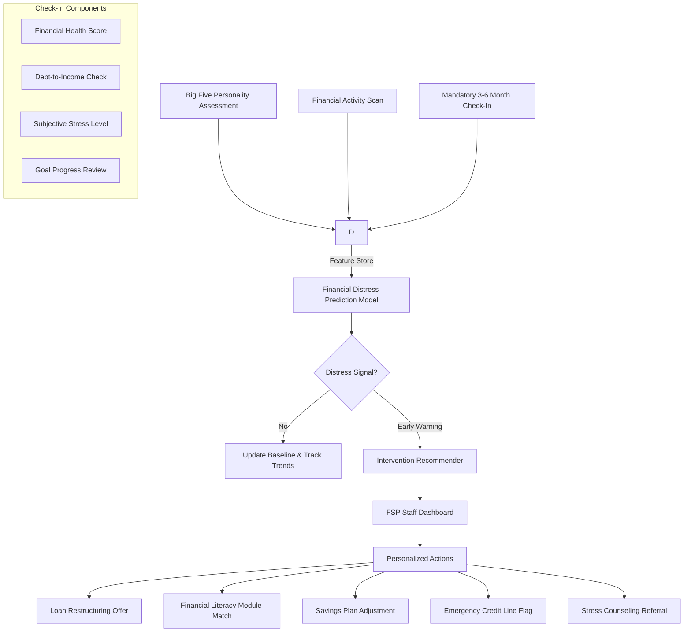

# IDEA 1: Personality-Based Financial Health Platform for Teachers

Back to: [[Ryy Understanding/Main Solution|Main Solution]]

---

## Quick Summary
A mobile-first financial health platform deployed through an FSP (e.g., a teachers' cooperative or MFI) that uses a **Big Five personality assessment** at onboarding + a **mandatory 3-6 month financial health check-in** to predict financial distress among public school teachers and recommend personalized interventions — turning the FSP from a passive lender into an active financial wellness partner.

---

## The Core Problem

Public school teachers in the Philippines are a "financially invisible at risk" population. Despite having stable government salaries, they are chronically trapped in debt cycles:

- **Borres (2023)** found that among 150 Senior High School teachers in CAMANAVA, saving, budgeting, and spending practices were *high*, but **investing and debt management were low**. Teachers reported "running out of money before the next paycheck" as the norm, with salary loans and borrowing from informal lenders as primary coping strategies.

- **Galicia et al. (2025)** — in a qualitative study of 7 teachers in Metro Manila and Southern Luzon — revealed that **accessibility of formal and informal lending**, the perennial **"breadwinner" setup**, and **expenses for further studies** create a structural debt trap. Teachers coined the term "Loandon" — a play on "London" — to describe their exhausting cycle of going to loan after loan.

- **Lofranco & Camasura (2024)** found that 86 junior high school teachers in Davao Region had *high financial literacy* but were *sometimes financially stressed*. The causes: mismanagement, patriarchal financial decision-making, and basic needs consuming most income.

The gap isn't knowledge — it's **behavioral**. Teachers know what to do; they don't have a tool that fits their psychology and pushes intervention at the right moment.

---

## The Core Insight

> Don't build another budgeting app. Build an **FSP-powered financial health coach** that uses personality insights + periodic check-ins to catch distress early and prescribe personalized interventions — before the teacher takes another "Loandon."

Teachers don't need another expense tracker. They need an FSP that *understands* them — their money personality, their stress triggers, their behavioral blind spots — and intervenes at the right time with the right product.

---

## Finverse Challenges Mapped

1. **Missing Contextual and Subjective Data**: FSPs see loan applications and repayment history, but they don't see the *teacher's financial stress level, personality-driven spending patterns, or subjective well-being*. The personality assessment and periodic check-in capture this missing layer — turning soft signals into structured data.

2. **Resource & Capacity Constraints**: Teachers' cooperatives and smaller MFIs don't have data scientists or behavioral economists. The platform automates the assessment, prediction, and recommendation pipeline — no specialized staff required.

3. **Difficulty Applying Data Insights to Real-World Decisions**: Even if FSPs had this data, they wouldn't know *what to do with it*. The platform doesn't just flag "at risk" teachers — it recommends specific interventions matched to personality type and current situation: loan restructuring, financial education module, savings plan adjustment, or emergency credit line.

---

## How It Works



### 1. Onboarding: Personality + Financial Baseline

| Step | What Happens | Tool |
|---|---|---|
| **Personality Assessment** | 25-item Big Five inventory adapted for financial context (openness, conscientiousness, extraversion, agreeableness, neuroticism) | In-app questionnaire (~5 min) |
| **Financial Activity Scan** | Digitize salary deductions, existing loans, savings, and expense patterns via FSP records + self-report | API from FSP system + form |
| **Baseline Financial Health Score** | Composite score based on CFPB Financial Well-Being Scale adapted for PH teachers | Automated calculation |

### 2. The Mandatory Check-In (Every 3-6 Months)

The unskippable check-in is the **core intervention mechanism**. It's not a survey — it's a structured financial health review:

| Component | What's Measured | Why It Matters |
|---|---|---|
| **Financial Health Score** | CFPB-aligned 10-item scale tracking financial security and freedom of choice | Measures *change* since last check-in |
| **Debt-to-Income Check** | Current loan obligations / monthly take-home pay | Flags when debt crosses 40% threshold |
| **Subjective Stress Level** | 1-5 Likert: "How stressed are you about money right now?" | Captures emotional dimension missed by hard data |
| **Goal Progress Review** | Last check-in goals vs. current status | Builds accountability and self-awareness |
| **Financial Activity Scan** | Recent transactions, new loans, savings movements, salary deductions | Detects behavioral changes since last check-in |

### 3. Prediction Model

- **Model**: Gradient-boosted ensemble (CatBoost / LightGBM) trained on historical teacher data from partner FSP
- **Target**: Probability of financial distress within the next 3-6 months (defined as: missed loan payment, new high-interest loan taken, savings drop below 1 month of expenses)
- **Features**: 20-25 signals including:
  - Big Five personality trait scores (especially conscientiousness, neuroticism)
  - Financial Health Score trend (baseline → 3mo → 6mo)
  - Debt-to-income ratio and trajectory
  - Subjective stress level and change over time
  - Number of active loans (formal + informal)
  - Salary grade, years of service, number of dependents
  - Check-in completion consistency (did they skip?)

### 4. Intervention Recommender

A rules engine + LLM layer that translates model output into FSP-facing recommendations:

```
Distress Score: 72/100 (Moderate-High Risk)
Personality Profile: High Neuroticism, Low Conscientiousness
Drivers: DTI increased from 35% to 52% in 6 months, 
         stress level 4/5, defaulted on one cooperative loan cycle
Personality-Matched Intervention:
  1. Loan restructuring: extend term from 12mo to 24mo (reduces monthly pressure)
  2. Financial literacy module: "Debt Snowball Method" (matches low conscientiousness — simple, structured)
  3. Trigger savings plan: auto-deduct 3% of salary before it hits account (removes friction)
  4. Flag loan officer for check-in call within 7 days
```

---

## Tech Stack

| Component | Technology |
|---|---|
| Mobile Interface | React Native (for teacher self-service) |
| FSP Staff Dashboard | React (web-based, optimized for low-bandwidth) |
| Backend | Python FastAPI |
| ML Model | CatBoost / LightGBM |
| Personality Assessment | IPIP Big-Five Factor Markers (public domain, validated) |
| Check-In Engine | Custom rules engine + LLM (small fine-tuned Phi-3 / Llama 3.2 for intervention explanations in Tagalog) |
| SMS/Voice Reminders | Twilio or Globe/Smart telco API |
| Data Storage | PostgreSQL + S3 for check-in history |

---

## Financial Health Impact

- **Daily Management**: The mandatory check-in forces teachers to periodically review income vs. obligations — building awareness even if they don't change behavior immediately. Automated savings triggers help smooth cashflow.
- **Economic Resilience**: Early warning system catches distress *before* a teacher resorts to informal lending. Loan restructuring at 50% DTI is better than a new loan at 15% monthly interest.
- **Long-term Planning**: Personality-matched financial literacy modules (e.g., "future-focused" content for low-openness teachers, "safety-first" content for high-neuroticism teachers) build planning capability gradually over multiple check-in cycles.
- **Financial Security**: The FSP shifts from "collector of monthly payments" to "partner in financial health." The check-in becomes a touchpoint for support, not surveillance.

---

## Why It's Different From Existing Financial Wellness Apps

| Typical Budgeting/Wellness App | This Idea |
|---|---|
| Relies on user self-motivation to track expenses | **Mandatory check-in** built into FSP relationship (unskippable) |
| One-size-fits-all advice | **Personality-matched** interventions (what works for a high-conscientiousness teacher won't work for a high-neuroticism one) |
| Direct-to-consumer (user must download and engage) | **Deployed through FSP** — teachers already have a relationship with the cooperative/MFI |
| Focuses on knowledge ("learn this") | Focuses on **behavior + timing** ("do this now") |
| No institutional feedback loop | FSP sees aggregate distress trends and can design better products |
| Anonymous, no accountability | The check-in creates **structured accountability** — the teacher knows someone is watching |

---

## RRL References

1. **Gladstone JJ, Matz SC, Lemaire A** (2019). Can Psychological Traits Be Inferred From Spending? Evidence From Transaction Data. *Psychological Science*, 30(8), 1157-1171. — ML models applied to 2M bank transactions from 2,193 people showed materialism (r = .42) and self-control could be inferred from spending patterns. **Basis**: spending data reveals personality — and vice versa.

2. **Matz SC, et al.** (2024). Leveraging Psychological Fit to Encourage Saving Behavior. *Journal of Marketing Research* (in press). — Field experiment with 6,056 low-income fintech users: people matched to personality-congruent savings goals were significantly more likely to reach savings targets. **Direct support**: personality-personalized financial interventions work.

3. **Greene C, Shy O, Stavins J** (2023). Personality Traits and Financial Outcomes. *Federal Reserve Bank of Boston Working Paper*, No. 23-4. — Less conscientious, more open, and more agreeable credit card holders are significantly more likely to revolve debt. **Direct support**: Big Five traits predict financial distress.

4. **Nguyen Q, Nguyen DT, Pham P** (2025). What Determines Personal Financial Behaviour? A Research on Individual Personality Traits and Emotions. *Journal of Finance and Economics*, 13(2). — SEM on 428 Vietnamese individuals; conscientiousness, openness, and emotional stability positively associated with sound financial behaviors; extraversion and agreeableness negatively associated with credit management.

5. **Clark RL, Lin C, Lusardi A, Mitchell OS, Sticha A** (2024). Evaluating the Effects of a Low-Cost, Online Financial Education Program. *GFLEC Working Paper*. — Short financial education stories had sizeable short-term effects on knowledge; risk diversification effects persisted for 8 months. **Supports**: periodic intervention with follow-up boosts lasting change.

6. **Sutter M, Weyland M, Untertrifaller A, Froitzheim M, Schneider SO** (2023). Financial Literacy, Experimental Preference Measures and Field Behavior — A Randomized Educational Intervention. *IZA Discussion Paper*, No. 16102. — Teaching financial literacy made 16-year-olds more patient and time-consistent; effects persisted up to 5 years with three-wave follow-up at 1 week, 6 months, and 3-5 years. **Direct support**: periodic longitudinal assessment is effective.

7. **Borres IL** (2023). Financial Management Practices and Coping Strategies among Senior High School Teachers in CAMANAVA: Financial Literacy Framework. *East African Scholars Journal of Economics, Business and Management*, 6(6). — 150 teachers surveyed; saving/budgeting practices high but investing and debt management low. Teachers rely on savings and reducing expenses when in distress.

8. **Galicia L, Obar SA, Ursodan VA, et al.** (2025). I Am Going to "Loandon": Understanding the Financial Challenges of Select Teachers in the Philippines. *SSRN*. — Qualitative study of 7 teachers; revealed structural debt trap from accessible lending, breadwinner responsibilities, and education expenses. Coined "Loandon" to describe the debt cycle.

9. **Lofranco MC, Camasura RR** (2024). A Mixed-Methods Sequential Explanatory Design Comparison Between Financial Literacy and Financial Stress of Junior High School Teachers in Davao Region. *TWIST*, 19(2), 340-347. — 86 teachers surveyed; high literacy but "sometimes stressed." Causes: mismanagement, patriarchal decision-making, basic needs consumption.

10. **Valdez ML** (2022). Smart Money: Teachers' Financial Literacy. *Journal of Production, Operations Management and Economics*, 2(03), 46-52. — Phenomenological study of 5 PH teachers; themes of financial contentment, strategies, budgeting, and saving emerged.

11. **Park CM, Howard KAS, Solberg VSH** (2025). Beyond the Basics: A Longitudinal Study of Financial Literacy Development in Young Women Alumni of the Invest in Girls Program. *Future Business Journal*, 11. — 98 interviews over 4 years; showed clear progression from basic tracking to sophisticated tools, with persistent need for practical tax and real-world education.

12. **Di Bu, Hanspal T, Liao Y, Liu Y** (2021). Cultivating Self-Control in FinTech: Evidence from a Field Experiment on Online Consumer Borrowing. *Journal of Financial and Quantitative Analysis*, 56(6). — Self-control training (tracking, budgeting, introspection) reduced online borrowing and delinquency more effectively than pure financial literacy. **Direct support**: self-reflection check-ins change behavior.

---

## Potential Partner

**CARD MRI (Philippines)** or **a dedicated teachers' cooperative/MFI** — CARD MRI has ~8M members, many of whom are public school teachers. They already have:
- Salary deduction arrangements with DepEd (Department of Education)
- Field officers who visit schools regularly
- Existing loan products for teachers (multi-purpose loans, salary loans)
- Trust among teachers as a "teacher-friendly" institution

Alternative: **Philippine Public School Teachers Association (PPSTA)** cooperative or **DepEd-accredited cooperatives** that handle salary loans directly.

---

## Open Questions & Risks

- **Mandatory check-in**: Will teachers see this as helpful or intrusive? Must frame as "financial health checkup" not "surveillance." Incentivize completion (e.g., lower interest rates for compliant teachers).
- **Personality assessment accuracy**: Self-report Big Five can be gamed. Need validity checks (reverse-coded items, attention checks). Consider initial test + refinement after first check-in.
- **FSP adoption**: Will CARD MRI or a teachers' coop adopt a personality-based tool? Need to demonstrate ROI — fewer defaults, better member retention, higher savings uptake.
- **Check-in fatigue**: Every 3-6 months may feel frequent. Keep each session under 10 minutes. Use SMS-based check-in as lighter alternative for intermediate months.
- **Privacy**: Personality and financial data is sensitive. Must design with data minimization — FSP sees only aggregated risk profiles and recommendations, not raw personality scores.
- **Model validation**: No labeled distress training data at start. Begin with rule-based heuristics (DTI thresholds, stress level escalation) and transition to ML as data accumulates.

---

## Next Steps

1. Validate with a teachers' cooperative or CARD MRI — do they see financial distress among teacher-members as a problem?
2. Pilot Big Five personality assessment with 30-50 teachers to check completion rates and face validity
3. Build prototype check-in flow (3 screens: health score, stress check, goal review) and test usability
4. Design intervention recommendation rules for first 5 distress scenarios
5. Identify 1-2 cooperatives or DepEd divisions for pilot study
