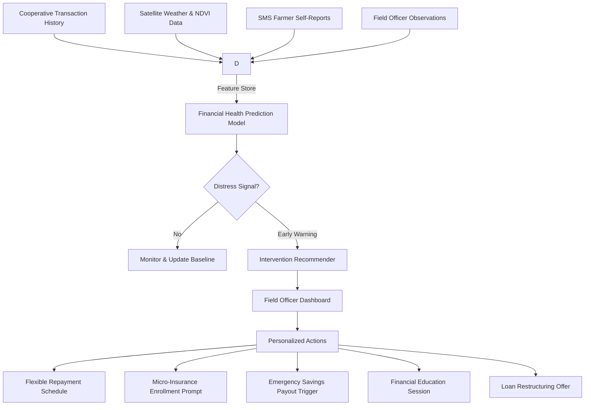

# IDEA 2: Field Officer Decision Support Platform for Smallholder Farmers

Back to: [[Ryy Understanding/Main Solution|Main Solution]]

---

## Quick Summary
A mobile-first decision-support platform for FSP field officers that ingests alternative data (cooperative records, satellite weather indices, SMS farmer self-reports, mobile money activity) to predict financial distress among smallholder farmers and recommend personalized interventions — before the farmer defaults or falls to predatory lenders.

---

## The Core Problem

Smallholder farmers are "credit invisible" — ~50% have no formal credit history despite years of farming (Jonnalagadda & Babu, 2026). FSPs can't assess risk without traditional data (land titles, salary slips, bank statements), so farmers are either:

- **Rejected** by formal institutions → forced to informal "5-6" lenders at predatory rates
- **Mis-served** with one-size-fits-all products that ignore seasonal, weather-dependent cashflow
- **Ignored** until they default, at which point the only action is collection, not intervention

**Galapin et al. (2025)** found that Filipino farmers have adequate financial *knowledge* but poor financial *behavior* — not because they're irresponsible, but because no tool fits their reality: lumpy income, no steady salary, weather-dependent cycles.

**Alok et al. (2022)** demonstrated that alternative data (mobile footprints, social connections) can substitute for credit bureau scores without raising default rates. But their study focused on urban consumers. This idea extends the same logic to the rural agri-context using farm-specific data.

---

## The Core Insight

> Don't build another scoring black box. Build a **field officer copilot** that turns scattered farmer data into actionable intervention prompts.

Field officers already visit villages, know the farmers, and have their trust. Give them a tool that makes each visit data-informed.

---

## Finverse Challenges Mapped

1. **Data Access, Collection & Sharing**: Farmers transact in cash and keep paper records. Instead of forcing digital adoption, we use what already exists — cooperative transaction logs, SMS-based self-reports, and field officer observations — as alternative data signals.

2. **Missing Contextual & Subjective Data**: Traditional credit ignores weather risk, crop cycles, and community dynamics. We integrate satellite vegetation indices (NDVI), rainfall anomalies, and cooperative participation metrics alongside farmer-submitted voice/SMS updates.

3. **Difficulty Applying Data Insights to Decisions**: FSPs have data but don't know what to do with it. The platform doesn't just produce a "risk score" — it recommends specific interventions: "offer flexible repayment," "trigger emergency savings payout," "schedule financial literacy visit," "cross-sell micro-insurance."

---

## How It Works



### 1. Data Ingestion

| Source | Type | Collection Method |
|---|---|---|
| Cooperative Records | Loan history, savings balance, meeting attendance | API from existing FSP system |
| Satellite APIs | NDVI (crop health), rainfall, typhoon paths | NASA MODIS / PAGASA feeds |
| Farmer Self-Reports | Crop status, expenses, wellbeing (yes/no anxiety) | SMS or voice call weekly |
| Field Officer Notes | Qualitative observations | Mobile form during visits |

### 2. Prediction Model

- **Model**: Gradient-boosted ensemble (CatBoost / LightGBM) trained on historical farmer data labeled for distress events (default, missed payment, drop in savings)
- **Target**: Probability of financial distress within the next 1-2 crop cycles (3-6 months)
- **Features**: 25-30 signals including:
  - NDVI decline trends (crop failure signal)
  - Rainfall deviation from historical norm
  - Cooperative savings withdrawal patterns
  - Loan repayment delay from previous cycles
  - Farmer-reported stress indicators
  - Time since last field officer visit

### 3. Intervention Recommender

A rules engine + LLM layer that translates model output into plain-language recommendations:

```
Distress Score: 78/100 (High Risk)
Drivers: NDVI drop 40% below seasonal norm, 2 delayed payments, farmer reported "no harvest this quarter"
Intervention: 
  1. Trigger emergency savings payout (if enrolled)
  2. Offer 60-day repayment moratorium
  3. Flag for field officer visit within 7 days with script: discuss loan restructuring options
```

---

## Tech Stack

| Component | Technology |
|---|---|
| Mobile Interface | React Native (works offline, syncs when connected) |
| Backend | Python FastAPI |
| ML Model | CatBoost / LightGBM (exportable to ONNX for edge inference) |
| SMS/Voice Layer | Twilio or local telco API (Globe/Smart) |
| Satellite Data | NASA MODIS / Sentinel-2 via Google Earth Engine API |
| LLM for Interventions | Small fine-tuned model (Phi-3 / Llama 3.2 1B) for generating intervention explanations in local language (Tagalog / Cebuano) |

---

## Financial Health Impact

- **Daily Management**: Farmers get their first structured cashflow overview through weekly SMS check-ins and cooperative transaction digitization.
- **Economic Resilience**: Early warning system triggers interventions (savings payout, insurance, loan moratorium) *before* the farmer defaults — preventing the spiral into informal debt.
- **Long-term Planning**: Good financial behavior tracked over time becomes a portable "financial health passport" that unlocks larger loans for equipment, land improvement, or diversification.
- **Financial Security**: Field officers arrive with solutions, not demands. The relationship shifts from "collector" to "partner in resilience."

---

## Why It's Different From Existing Agri-Credit Ideas

| Typical Agri-Credit Approach | This Idea |
|---|---|
| Credit score black box (approved/denied) | Financial health heatmap + intervention prompts |
| Requires smartphone app from farmer | Farmer only needs SMS-capable phone |
| Focuses on lending decision only | Covers entire financial health cycle |
| Ignores behavioral/emotional signals | Incorporates farmer-reported subjective wellbeing |
| One-size-fits-all loan product | Dynamic, situation-aware recommendations |

---

## RRL References

1. **Jonnalagadda AK, Babu SR** (2026). Drivers of Credit Uptake by Smallholder Farmers: Empirical Evidence from India's Agricultural Sector. *International Research Journal of Multidisciplinary Scope*, 7(2), 110-119. — Found ~50% of smallholders are "credit invisible" and demonstrated that a 5C-based alternative scoring model mapping both traditional and alternative data can enhance prediction and inclusion.

2. **Alok S, Agarwal S, Ghosh P, Gupta S** (2022). Financial Inclusion and Alternate Credit Scoring: Role of Big Data and Machine Learning in Fintech. *Journal of Money, Credit, and Banking*. — Using mobile phone alternative data (apps, call logs, social connections) can substitute for credit bureau scores and expand credit access for financially excluded individuals without increasing default rates.

3. **Galapin RG, Ibieza DB, Vergara JT** (2025). Assessing Financial Literacy Levels Among Small-Scale Farmers. *International Journal of Research and Innovation in Social Science*, 9(14), 2059-2068. — Filipino farmers in Guimaras show adequate financial knowledge but significant behavioral gaps in investment, savings, and long-term planning.

4. **Taylor EB, Broløs A** (2023). Digital Change in Smallholder Farming in the Philippines: Emerging Practices in e-Commerce and Finance. *ResearchGate*. — Interviewed 23 smallholder farmers in PH; found adoption of digital financial tools is uneven and driven by trust in local intermediaries, not app features.

5. **Reyes CM, Tabuga AD, Borromeo NAB, Arboneda AA, Cabaero C** (2019). Towards a More Inclusive Agricultural Insurance Program. *PIDS Discussion Paper Series*, No. 2019-38. — Examined barriers to agri-insurance adoption in PH; recommended parametric triggers and simplified enrollment.

---

## Potential Partner

**CARD MRI (Philippines)** — Leading microfinance group with ~8M members, mostly rural women and farmers. Already has:
- Field officers doing regular village visits
- Existing cooperative groups with transaction history
- Micro-insurance and micro-savings products to cross-sell
- Trust in underserved communities

---

## Open Questions & Risks

- **Data availability**: Will CARD MRI share cooperative transaction data for model training? Need to clarify anonymization requirements.
- **Model validation**: No labeled distress data for training initially — might need unsupervised anomaly detection as a starting point.
- **Farmer SMS adoption**: Can we keep weekly self-report response rates high? Consider gamification or small load rewards.
- **Offline-first**: Field officers in remote areas have intermittent connectivity. Must design for offline caching and sync.

---

## Next Steps

1. Validate interest with CARD MRI — do they have existing distress prediction needs?
2. Test SMS-based farmer reporting with 20-30 farmers for 2 weeks
3. Build prototype dashboard with mock data for field officer feedback
4. Identify 3 specific cooperatives for pilot
